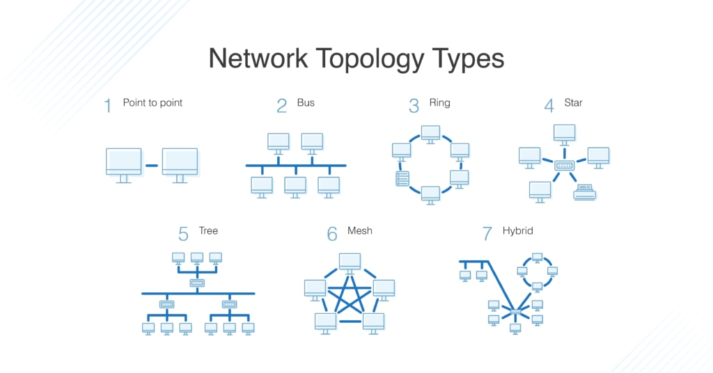
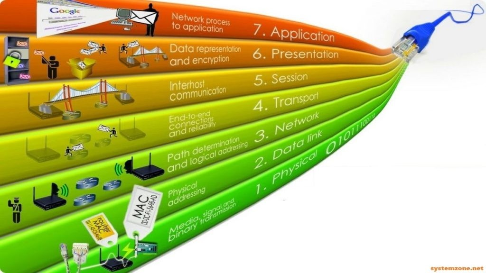

# <div align="center" style="color: #2E86AB; font-size: 2.5em; font-weight: bold;">Chapter 0: Cybersecurity Foundations</div>

## <span style="color: #A23B72; font-size: 1.8em; font-weight: bold;">Learning Objectives</span>

By the end of this chapter, students will be able to:
- Understand the fundamental concepts of cybersecurity
- Identify different types of cyber threats and attacks
- Comprehend cybersecurity frameworks and standards
- Understand risk management principles
- Learn about cybersecurity governance and compliance
- Understand the role of cybersecurity in modern organizations
- Prepare for specialized cybersecurity modules (including ethical hacking)

## <span style="color: #A23B72; font-size: 1.8em; font-weight: bold;">0.1 Introduction to Cybersecurity</span>

### <span style="color: #F18F01; font-size: 1.4em; font-weight: bold;">What is Cybersecurity?</span>

Cybersecurity is the practice of protecting systems, networks, and digital assets from cyber threats, damage, or unauthorized access. It encompasses a broad range of technologies, processes, and practices designed to safeguard digital information and infrastructure.

### <span style="color: #F18F01; font-size: 1.4em; font-weight: bold;">The Cybersecurity Landscape</span>

The digital world faces an ever-evolving threat landscape where:
- **Attackers** are becoming more sophisticated and organized
- **Attack vectors** are expanding with new technologies
- **Attack surfaces** are growing with digital transformation
- **Regulatory requirements** are becoming more stringent
- **Business impact** of cyber incidents is increasing

### <span style="color: #F18F01; font-size: 1.4em; font-weight: bold;">Key Cybersecurity Principles</span>

1. **Confidentiality**: Ensuring that information is accessible only to authorized individuals
2. **Integrity**: Maintaining the accuracy and completeness of information
3. **Availability**: Ensuring that information and systems are accessible when needed
4. **Authentication**: Verifying the identity of users and systems
5. **Authorization**: Controlling access to resources based on user roles
6. **Non-repudiation**: Ensuring that actions cannot be denied by the parties involved

## <span style="color: #A23B72; font-size: 1.8em; font-weight: bold;">0.1.5 How the Internet Works: The Physical Infrastructure</span>

### <span style="color: #F18F01; font-size: 1.4em; font-weight: bold;">The Internet: A Global Network of Networks</span>

**What is the Internet?**
The internet is a vast global network of interconnected computers and devices that communicate using standardized protocols. Think of it as the world's largest postal system, but instead of delivering physical mail, it delivers digital information at the speed of light.

**Real-world analogy**: Like a massive highway system connecting every city, town, and village in the world - the internet connects every computer, smartphone, and device globally.

### <span style="color: #F18F01; font-size: 1.4em; font-weight: bold;">The Physical Infrastructure of the Internet</span>

#### <span style="color: #C73E1D; font-size: 1.2em; font-weight: bold;">Underwater Fiber Optic Cables</span>

**The Backbone of Global Communication**
- **Total Length**: Over 1.2 million kilometers of submarine cables worldwide
- **Number of Cables**: 400+ active submarine cables
- **Data Capacity**: Each cable can carry terabits of data per second
- **Coverage**: 99% of international internet traffic travels through these cables

**Major Submarine Cable Systems:**
```
ASCII Diagram - Global Submarine Cable Network:
┌─────────────────────────────────────────────────────────────┐
│                    North America                            │
│  ┌─────────┐    ┌─────────┐    ┌─────────┐                │
│  │   USA   │    │ Canada  │    │ Mexico   │                │
│  └─────────┘    └─────────┘    └─────────┘                │
│       │              │              │                      │
│       └──────────────┼──────────────┘                      │
│                      │                                     │
│              ┌───────▼───────┐                            │
│              │ Atlantic Ocean │                            │
│              │   Cables       │                            │
│              └───────┬───────┘                            │
│                      │                                     │
│              ┌───────▼───────┐                            │
│              │   Europe      │                            │
│              │  ┌─────────┐  │                            │
│              │  │  UK     │  │                            │
│              │  └─────────┘  │                            │
│              │  ┌─────────┐  │                            │
│              │  │ France  │  │                            │
│              │  └─────────┘  │                            │
│              └───────────────┘                            │
└─────────────────────────────────────────────────────────────┘
```

**How Underwater Cables Work:**
1. **Fiber Optic Technology**: Light signals travel through glass fibers
2. **Repeater Stations**: Amplify signals every 50-100 kilometers
3. **Protection**: Steel armor and polyethylene coating
4. **Depth**: Laid on ocean floor, up to 8,000 meters deep
5. **Lifespan**: 25+ years of operation

**Real-world example**: Like a super-highway under the ocean - instead of cars, it carries light signals with your emails, videos, and web pages.

#### <span style="color: #C73E1D; font-size: 1.2em; font-weight: bold;">Major Submarine Cable Routes</span>

**Trans-Atlantic Cables**
- **MAREA**: 6,600 km from Virginia to Spain (160 Tbps capacity)
- **Hibernia Express**: 4,600 km from New York to London
- **AEConnect**: 5,500 km from New York to Ireland

**Trans-Pacific Cables**
- **FASTER**: 9,000 km from Japan to Oregon (60 Tbps capacity)
- **Unity**: 9,620 km from Japan to California
- **NCP**: 10,000 km from Singapore to California

**Real-world impact**: When one of these cables is damaged, internet speeds can slow down globally. In 2008, three cables were cut near Egypt, affecting 70% of internet traffic between Europe and Asia.

#### <span style="color: #C73E1D; font-size: 1.2em; font-weight: bold;">Land-Based Infrastructure</span>

**Internet Exchange Points (IXPs)**
- **Purpose**: Where different networks connect and exchange traffic
- **Major IXPs**: DE-CIX (Frankfurt), AMS-IX (Amsterdam), LINX (London)
- **Traffic**: Handle petabytes of data daily
- **Real-world analogy**: Like major airports where different airlines connect their routes

**Data Centers**
- **Purpose**: House servers and networking equipment
- **Size**: Some cover millions of square feet
- **Power**: Consume massive amounts of electricity
- **Cooling**: Sophisticated cooling systems to prevent overheating
- **Real-world example**: Like massive warehouses storing and processing digital information

**Content Delivery Networks (CDNs)**
- **Purpose**: Cache popular content closer to users
- **Companies**: Cloudflare, Akamai, Amazon CloudFront
- **Benefit**: Faster loading times for websites and videos
- **Real-world analogy**: Like having local libraries in every neighborhood instead of one central library

### <span style="color: #F18F01; font-size: 1.4em; font-weight: bold;">How Data Travels Through the Internet</span>

#### <span style="color: #C73E1D; font-size: 1.2em; font-weight: bold;">Step-by-Step Data Journey</span>

**Example: Loading a Website from Japan to USA**

**Step 1: User Request**
- You type "google.com" in your browser
- Your device creates a data packet with the request
- **Real-world analogy**: Like writing a letter and putting it in an envelope

**Step 2: Local Network**
- Data travels through your home Wi-Fi
- Goes to your internet service provider (ISP)
- **Real-world analogy**: Like taking your letter to the local post office

**Step 3: National Network**
- ISP routes data through national infrastructure
- May pass through multiple routers and switches
- **Real-world analogy**: Like your letter going through regional sorting centers

**Step 4: International Connection**
- Data travels through submarine cables under the ocean
- May pass through multiple countries and continents
- **Real-world analogy**: Like your letter crossing international borders

**Step 5: Destination Network**
- Data reaches the destination server
- Server processes the request and sends response
- **Real-world analogy**: Like the recipient reading your letter and writing a reply

**Step 6: Return Journey**
- Response data travels back through the same path
- Your browser receives and displays the webpage
- **Real-world analogy**: Like receiving the reply letter

#### <span style="color: #C73E1D; font-size: 1.2em; font-weight: bold;">Physical Components</span>

**Fiber Optic Cables**
- **Material**: Glass fibers thinner than human hair
- **Speed**: Light travels at 200,000 km/s through fiber
- **Capacity**: Can carry thousands of simultaneous conversations
- **Real-world analogy**: Like having thousands of phone lines in a single cable

**Routers and Switches**
- **Purpose**: Direct data packets to their destinations
- **Speed**: Process millions of packets per second
- **Intelligence**: Make routing decisions based on network conditions
- **Real-world analogy**: Like traffic controllers directing vehicles to their destinations

**Satellites (Alternative Path)**
- **Purpose**: Provide internet access to remote areas
- **Latency**: Higher delay due to distance to space
- **Coverage**: Can reach anywhere on Earth
- **Real-world analogy**: Like using radio communication instead of phone lines

### <span style="color: #F18F01; font-size: 1.4em; font-weight: bold;">Internet Architecture: The Big Picture</span>

```
ASCII Diagram - Internet Architecture:
┌─────────────────────────────────────────────────────────────┐
│                    End Users                               │
│  ┌─────────┐  ┌─────────┐  ┌─────────┐  ┌─────────┐        │
│  │Computer │  │ Phone   │  │ Tablet  │  │ IoT     │        │
│  └─────────┘  └─────────┘  └─────────┘  └─────────┘        │
│       │              │              │              │        │
│       └──────────────┼──────────────┼──────────────┘        │
│                      │              │                       │
│              ┌───────▼───────┐      │                       │
│              │ Local ISPs   │      │                       │
│              │ (Home/Office) │      │                       │
│              └───────┬───────┘      │                       │
│                      │              │                       │
│              ┌───────▼───────┐      │                       │
│              │ Regional      │      │                       │
│              │ Networks      │      │                       │
│              └───────┬───────┘      │                       │
│                      │              │                       │
│              ┌───────▼───────┐      │                       │
│              │ Tier 1 ISPs  │      │                       │
│              │ (Backbone)   │      │                       │
│              └───────┬───────┘      │                       │
│                      │              │                       │
│              ┌───────▼───────┐      │                       │
│              │ Submarine    │      │                       │
│              │ Cables       │      │                       │
│              └───────┬───────┘      │                       │
│                      │              │                       │
│              ┌───────▼───────┐      │                       │
│              │ Data Centers  │      │                       │
│              │ & Servers     │      │                       │
│              └──────────────┘      │                       │
└─────────────────────────────────────────────────────────────┘
```

### <span style="color: #F18F01; font-size: 1.4em; font-weight: bold;">Internet Security and Physical Infrastructure</span>

#### <span style="color: #C73E1D; font-size: 1.2em; font-weight: bold;">Physical Security Threats</span>

**Cable Sabotage**
- **Risk**: Cutting submarine cables can disrupt internet traffic
- **Examples**: 2008 Egypt cable cuts, 2011 Japan earthquake damage
- **Protection**: Redundant cable routes, cable monitoring systems
- **Real-world impact**: Can affect millions of users globally

**Data Center Attacks**
- **Risk**: Physical attacks on data centers
- **Protection**: Security guards, biometric access, surveillance
- **Redundancy**: Multiple data centers in different locations
- **Real-world example**: Like protecting banks with multiple vaults

#### <span style="color: #C73E1D; font-size: 1.2em; font-weight: bold;">Cybersecurity Implications</span>

**Traffic Analysis**
- **What it is**: Monitoring data flow through physical infrastructure
- **Risk**: Revealing communication patterns and user behavior
- **Prevention**: Encryption, traffic obfuscation, VPNs
- **Real-world analogy**: Like analyzing postal patterns to track people

**Infrastructure Monitoring**
- **Purpose**: Detecting anomalies in network traffic
- **Tools**: Network monitoring systems, traffic analysis
- **Benefits**: Early threat detection, performance optimization
- **Real-world example**: Like traffic monitoring systems on highways

### <span style="color: #F18F01; font-size: 1.4em; font-weight: bold;">The Future of Internet Infrastructure</span>

#### <span style="color: #C73E1D; font-size: 1.2em; font-weight: bold;">Emerging Technologies</span>

**5G Networks**
- **Speed**: 100x faster than 4G
- **Latency**: Ultra-low delay (1ms)
- **Capacity**: Support for millions of connected devices
- **Real-world impact**: Enables autonomous vehicles, smart cities

**Satellite Internet**
- **Companies**: SpaceX Starlink, Amazon Kuiper
- **Coverage**: Global internet access
- **Latency**: Lower than traditional satellite internet
- **Real-world example**: Like having internet access anywhere on Earth

**Edge Computing**
- **Purpose**: Process data closer to users
- **Benefits**: Lower latency, reduced bandwidth usage
- **Applications**: IoT, autonomous vehicles, smart cities
- **Real-world analogy**: Like having local processing power instead of sending everything to a central computer

#### <span style="color: #C73E1D; font-size: 1.2em; font-weight: bold;">Environmental Impact</span>

**Energy Consumption**
- **Data Centers**: Consume 1-2% of global electricity
- **Cooling**: Significant energy for temperature control
- **Renewable Energy**: Many companies switching to green energy
- **Real-world impact**: Internet infrastructure has a carbon footprint

**Cable Maintenance**
- **Repair Ships**: Specialized vessels for cable repairs
- **Environmental Protection**: Cables designed to minimize ocean impact
- **Marine Life**: Cables can provide artificial reefs
- **Real-world example**: Like maintaining highways, but under the ocean

### <span style="color: #F18F01; font-size: 1.4em; font-weight: bold;">Understanding Internet Resilience</span>

**Redundancy and Backup Systems**
- **Multiple Routes**: Data can take different paths
- **Automatic Failover**: Systems switch to backup routes
- **Geographic Distribution**: Servers in multiple locations
- **Real-world analogy**: Like having multiple roads to reach the same destination

**Disaster Recovery**
- **Natural Disasters**: Earthquakes, hurricanes can damage infrastructure
- **Human Error**: Accidental cable cuts during construction
- **Cyber Attacks**: Digital attacks on physical infrastructure
- **Recovery Time**: Hours to days for major outages
- **Real-world example**: Like having backup power systems for critical facilities

**Real-world Impact**: Understanding the physical infrastructure helps cybersecurity professionals protect the internet's backbone and ensure global connectivity remains secure and reliable.

## <span style="color: #A23B72; font-size: 1.8em; font-weight: bold;">0.2 Cyber Threat Landscape</span>

### <span style="color: #F18F01; font-size: 1.4em; font-weight: bold;">0.2.1 Types of Cyber Threats</span>

#### <span style="color: #C73E1D; font-size: 1.2em; font-weight: bold;">Malware</span>

**Viruses**: Self-replicating programs that attach to legitimate files
- **Example**: ILOVEYOU virus (2000) - Spread via email attachments, infected 50+ million computers, caused $15 billion in damages
- **Real Case**: Melissa virus (1999) - First major email virus, infected 1 million computers, caused $80 million in damages

**Worms**: Self-replicating programs that spread across networks
- **Example**: WannaCry ransomware worm (2017) - Exploited Windows SMB vulnerability, infected 300,000+ computers in 150 countries
- **Real Case**: Conficker worm (2008) - Infected 9-15 million computers, created largest botnet in history

**Trojans**: Malicious programs disguised as legitimate software
- **Example**: Zeus Trojan (2007-2010) - Banking trojan that stole millions from online banking accounts
- **Real Case**: Emotet Trojan (2014-2021) - Banking trojan that evolved into malware-as-a-service, caused $2.5 billion in damages

**Ransomware**: Malware that encrypts data and demands payment
- **Example**: Colonial Pipeline attack (2021) - DarkSide ransomware shut down largest US fuel pipeline, caused gas shortages
- **Real Case**: WannaCry (2017) - Affected NHS hospitals, FedEx, Deutsche Bahn, caused $4 billion in damages

**Spyware**: Software that secretly monitors user activities
- **Example**: Pegasus spyware (2016-present) - NSO Group's surveillance software targeting journalists and activists
- **Real Case**: FinFisher (2011-2018) - Government surveillance software used by 36 countries for targeted surveillance

**Adware**: Software that displays unwanted advertisements
- **Example**: Superfish adware (2014-2015) - Pre-installed on Lenovo computers, injected ads and compromised SSL certificates
- **Real Case**: Claria Corporation (2000s) - One of the largest adware distributors, settled with FTC for $3 million

#### <span style="color: #C73E1D; font-size: 1.2em; font-weight: bold;">Social Engineering</span>

**Phishing**: Fraudulent attempts to obtain sensitive information
- **Example**: Google Docs phishing (2017) - Fake Google Docs emails tricked 1 million+ users into granting access to their accounts
- **Real Case**: Target breach (2013) - Phishing email to HVAC vendor led to 40 million credit cards stolen, $18.5 million settlement

**Spear Phishing**: Targeted phishing attacks on specific individuals
- **Example**: RSA Security breach (2011) - Spear phishing email with Excel attachment compromised SecurID tokens, cost $66 million
- **Real Case**: Ubiquiti Networks (2015) - Spear phishing attack resulted in $46.7 million theft through fake vendor payments

**Whaling**: Phishing attacks targeting high-level executives
- **Example**: Snapchat CEO incident (2016) - Fake email from CEO led to disclosure of employee payroll information
- **Real Case**: FACC (2016) - Whaling attack on Austrian aerospace company resulted in €42 million theft

**Vishing**: Voice-based phishing attacks
- **Example**: IRS impersonation scams (2014-2019) - Scammers posed as IRS agents, stole $54 million from 15,000+ victims
- **Real Case**: Tech support scams (2010-present) - Microsoft tech support impersonation, victims lost $1.5 billion globally

**Smishing**: SMS-based phishing attacks
- **Example**: COVID-19 smishing (2020) - Fake vaccine appointment texts, stimulus check scams, contact tracing fraud
- **Real Case**: SIM swapping attacks (2018-2020) - SMS-based attacks on cryptocurrency exchanges, $100+ million stolen

**Pretexting**: Creating false scenarios to obtain information
- **Example**: HP pretexting scandal (2006) - Private investigators used pretexting to obtain phone records of journalists and board members
- **Real Case**: Kevin Mitnick case (1990s) - Famous social engineer used pretexting to gain unauthorized access to computer systems

#### <span style="color: #C73E1D; font-size: 1.2em; font-weight: bold;">Advanced Persistent Threats (APTs)</span>

**Nation-state actors**: Government-sponsored cyber attacks
- **Example**: Stuxnet (2010) - US/Israeli cyberweapon targeting Iranian nuclear facilities, first known cyberweapon
- **Real Case**: SolarWinds attack (2020) - Russian APT group compromised 18,000+ organizations including Microsoft, FireEye, and US government agencies

**Cyber espionage**: Stealing sensitive information
- **Example**: Operation Aurora (2009) - Chinese APT group targeted Google, Adobe, and 20+ other companies for intellectual property
- **Real Case**: APT1 (2013) - Chinese military unit 61398 conducted cyber espionage against 141 companies over 7 years

**Supply chain attacks**: Compromising trusted vendors
- **Example**: NotPetya (2017) - Russian military cyberattack spread via Ukrainian accounting software, caused $10+ billion in damages
- **Real Case**: CCleaner compromise (2017) - Malware inserted into legitimate software, infected 2.3 million users

**Zero-day exploits**: Attacks using unknown vulnerabilities
- **Example**: EternalBlue (2017) - NSA-developed exploit leaked by Shadow Brokers, used in WannaCry and NotPetya
- **Real Case**: Stuxnet (2010) - Used 4 zero-day exploits to target Iranian nuclear facilities

### <span style="color: #F18F01; font-size: 1.4em; font-weight: bold;">0.2.2 Attack Vectors</span>

#### <span style="color: #C73E1D; font-size: 1.2em; font-weight: bold;">Network-based Attacks</span>

**DDoS (Distributed Denial of Service)**: Overwhelming systems with traffic
- **Example**: GitHub DDoS (2018) - 1.35 Tbps attack using memcached amplification, largest DDoS attack at the time
- **Real Case**: Dyn DNS attack (2016) - Mirai botnet DDoS took down major websites including Twitter, Netflix, Reddit, causing $110 million in damages

**Man-in-the-Middle (MITM)**: Intercepting communications
- **Example**: Superfish adware (2014-2015) - Lenovo computers had pre-installed adware that performed MITM attacks on HTTPS connections
- **Real Case**: DigiNotar breach (2011) - Dutch certificate authority compromised, issued fake SSL certificates for Google, Facebook, and other major sites

**DNS poisoning**: Redirecting traffic to malicious sites
- **Example**: Brazilian bank attacks (2016) - DNS poisoning redirected customers to fake banking websites, stole millions
- **Real Case**: Kaminsky DNS vulnerability (2008) - Dan Kaminsky discovered critical DNS flaw affecting all DNS servers globally

**ARP spoofing**: Redirecting network traffic
- **Example**: WiFi Pineapple attacks (2010s) - Hak5's WiFi Pineapple device used ARP spoofing to intercept traffic on public WiFi networks
- **Real Case**: Starbucks WiFi attacks (2014) - Attackers used ARP spoofing to intercept customer data on Starbucks WiFi networks

**Port scanning**: Identifying open services and vulnerabilities
- **Example**: Shodan search engine (2009-present) - Continuously scans internet for open ports and services, exposing vulnerable systems
- **Real Case**: Equifax breach (2017) - Attackers used port scanning to discover unpatched Apache Struts vulnerability, exposed 147 million records

#### <span style="color: #C73E1D; font-size: 1.2em; font-weight: bold;">Application-based Attacks</span>

**SQL Injection**: Exploiting database vulnerabilities
- **Example**: Sony Pictures breach (2014) - SQL injection led to theft of 100TB of data including employee records and unreleased movies
- **Real Case**: Heartland Payment Systems (2008) - SQL injection compromised 130 million credit cards, largest credit card breach at the time

**Cross-Site Scripting (XSS)**: Injecting malicious scripts
- **Example**: MySpace XSS worm (2005) - Samy worm spread across 1 million profiles in 20 hours, first major XSS attack
- **Real Case**: Twitter XSS (2010) - XSS vulnerability allowed attackers to post tweets on behalf of users, including Barack Obama and Britney Spears

**Cross-Site Request Forgery (CSRF)**: Forcing unauthorized actions
- **Example**: Gmail CSRF (2007) - CSRF vulnerability allowed attackers to read victims' emails and send emails on their behalf
- **Real Case**: YouTube CSRF (2008) - CSRF attack allowed attackers to add videos to users' favorites and subscribe to channels

**Buffer Overflow**: Exploiting memory management vulnerabilities
- **Example**: Code Red worm (2001) - Buffer overflow in IIS web server infected 359,000 computers in 14 hours
- **Real Case**: Morris worm (1988) - First major internet worm, buffer overflow exploit caused first DDoS attack, infected 10% of internet

**Insecure Direct Object References**: Accessing unauthorized data
- **Example**: Facebook photo access (2009) - Insecure direct object references allowed access to private photos of 14 million users
- **Real Case**: Healthcare.gov (2013) - Insecure direct object references exposed personal information of 7,000 users

#### <span style="color: #C73E1D; font-size: 1.2em; font-weight: bold;">System-based Attacks</span>

**Privilege Escalation**: Gaining higher-level access
- **Example**: Dirty COW vulnerability (2016) - Linux privilege escalation bug allowed any user to gain root access, affected billions of devices
- **Real Case**: Windows privilege escalation (2017) - CVE-2017-0213 allowed attackers to escalate privileges on Windows systems

**Rootkits**: Concealing malicious activities
- **Example**: Sony BMG rootkit (2005) - Sony installed rootkit on 22 million CDs to prevent copying, created security vulnerabilities
- **Real Case**: Stuxnet rootkit (2010) - Sophisticated rootkit used to hide malicious code targeting Iranian nuclear facilities

**Backdoors**: Creating unauthorized access points
- **Example**: Juniper Networks backdoor (2015) - NSA backdoor discovered in Juniper firewalls, allowed decryption of VPN traffic
- **Real Case**: SolarWinds backdoor (2020) - Russian hackers inserted backdoor in SolarWinds software, compromised 18,000+ organizations

**Keyloggers**: Capturing user input
- **Example**: Zeus banking trojan (2007-2010) - Keylogger component captured banking credentials, stole millions from online accounts
- **Real Case**: Operation High Roller (2012) - Keylogger attacks on high-net-worth individuals, stole $78 million from 60+ financial institutions

**Screen scrapers**: Capturing screen content
- **Example**: Formjacking attacks (2018-2019) - Screen scraping malware captured payment card data from e-commerce websites, affected 4,000+ sites
- **Real Case**: Magecart attacks (2015-present) - Screen scraping attacks on e-commerce sites, compromised 17,000+ websites including British Airways and Ticketmaster

### <span style="color: #F18F01; font-size: 1.4em; font-weight: bold;">0.2.3 Major Cybersecurity Incidents</span>

#### <span style="color: #C73E1D; font-size: 1.2em; font-weight: bold;">Data Breaches</span>
**Yahoo Data Breaches (2013-2014)**
- **Impact**: 3 billion user accounts compromised (largest data breach in history)
- **Cost**: $350 million reduction in Verizon acquisition price
- **Details**: Stolen data included names, email addresses, phone numbers, birth dates, and security questions

**Equifax Breach (2017)**
- **Impact**: 147 million consumers affected (45% of US population)
- **Cost**: $1.4 billion in settlements and security improvements
- **Details**: Exposed Social Security numbers, birth dates, addresses, and driver's license numbers

**Marriott International (2018)**
- **Impact**: 500 million guests affected
- **Cost**: $72 million in GDPR fines
- **Details**: Stolen data included names, addresses, phone numbers, email addresses, and passport numbers

#### <span style="color: #C73E1D; font-size: 1.2em; font-weight: bold;">Ransomware Attacks</span>
**WannaCry (2017)**
- **Impact**: 300,000+ computers in 150 countries
- **Cost**: $4 billion in damages globally
- **Details**: Affected NHS hospitals, FedEx, Deutsche Bahn, and other major organizations

**NotPetya (2017)**
- **Impact**: Global supply chain attack
- **Cost**: $10+ billion in damages
- **Details**: Spread via Ukrainian accounting software, affected Maersk, Merck, and FedEx

**Colonial Pipeline (2021)**
- **Impact**: Largest US fuel pipeline shut down for 6 days
- **Cost**: $4.4 million ransom paid, gas shortages across US East Coast
- **Details**: DarkSide ransomware group targeted critical infrastructure

#### <span style="color: #C73E1D; font-size: 1.2em; font-weight: bold;">Nation-State Attacks</span>
**SolarWinds Supply Chain Attack (2020)**
- **Impact**: 18,000+ organizations compromised
- **Cost**: $100+ million in damages
- **Details**: Russian APT group compromised software update mechanism, affected Microsoft, FireEye, and US government agencies

**Stuxnet (2010)**
- **Impact**: Iranian nuclear facilities damaged
- **Cost**: Estimated $1+ billion in damages
- **Details**: First known cyberweapon, used 4 zero-day exploits to target industrial control systems

**Operation Aurora (2009)**
- **Impact**: 20+ major companies targeted
- **Cost**: $100+ million in damages
- **Details**: Chinese APT group targeted Google, Adobe, and other companies for intellectual property theft

#### <span style="color: #C73E1D; font-size: 1.2em; font-weight: bold;">Financial Cybercrime</span>
**Carbanak Banking Trojan (2013-2018)**
- **Impact**: $1+ billion stolen from 100+ banks
- **Cost**: $1.2 billion in losses
- **Details**: Targeted bank employees and ATMs across 40 countries

**Bangladesh Bank Heist (2016)**
- **Impact**: $81 million stolen from central bank
- **Cost**: $81 million in losses
- **Details**: North Korean hackers used SWIFT network to transfer funds to Philippines

**Cosmos Bank Attack (2018)**
- **Impact**: $13.5 million stolen from Indian bank
- **Cost**: $13.5 million in losses
- **Details**: Attackers compromised bank's core banking system and ATMs

#### <span style="color: #C73E1D; font-size: 1.2em; font-weight: bold;">Critical Infrastructure Attacks</span>
**Ukrainian Power Grid (2015-2016)**
- **Impact**: 225,000 customers without power
- **Cost**: $1+ billion in damages
- **Details**: First known cyberattack to cause power outages, used BlackEnergy malware

**Triton/Trisis (2017)**
- **Impact**: Industrial safety systems compromised
- **Cost**: Unknown (potential for catastrophic damage)
- **Details**: Malware designed to disable safety systems in industrial facilities

**Oldsmar Water Treatment (2021)**
- **Impact**: Attempted to poison water supply
- **Cost**: Minimal (attack prevented)
- **Details**: Remote access compromise attempted to increase sodium hydroxide levels

## <span style="color: #A23B72; font-size: 1.8em; font-weight: bold;">0.3 Networking 101</span>

### <span style="color: #F18F01; font-size: 1.4em; font-weight: bold;">0.3.1 Network Fundamentals</span>

#### <span style="color: #C73E1D; font-size: 1.2em; font-weight: bold;">What is a Network?</span>
A network is a collection of interconnected devices that can communicate and share resources. Networks enable data transmission between computers, servers, and other devices.

#### <span style="color: #C73E1D; font-size: 1.2em; font-weight: bold;">Network Types</span>
- **Local Area Network (LAN)**: Small geographic area (office, home)
- **Wide Area Network (WAN)**: Large geographic area (internet, corporate networks)
- **Metropolitan Area Network (MAN)**: City-wide networks
- **Personal Area Network (PAN)**: Personal devices (Bluetooth, USB)
- **Virtual Private Network (VPN)**: Secure connection over public networks

#### <span style="color: #C73E1D; font-size: 1.2em; font-weight: bold;">Network Topologies</span>



**Star Topology**: All devices connected to central hub
- **Description**: Most common topology where all devices connect to a central switch or hub
- **Advantages**: Easy to manage, fault isolation, easy to add/remove devices
- **Disadvantages**: Single point of failure (central device), requires more cable
- **Security**: Centralized control, easy to monitor traffic
- **Use Cases**: Home networks, small offices, LANs

**Bus Topology**: All devices connected to single cable
- **Description**: All devices share a single communication line (backbone cable)
- **Advantages**: Simple, inexpensive, easy to install
- **Disadvantages**: Single point of failure, difficult to troubleshoot, performance degrades with more devices
- **Security**: All traffic visible to all devices, vulnerable to eavesdropping
- **Use Cases**: Legacy networks, small temporary networks

**Ring Topology**: Devices connected in circular pattern
- **Description**: Devices connected in a closed loop where data travels in one direction
- **Advantages**: No collisions, predictable performance, easy to install
- **Disadvantages**: Single point of failure, difficult to add/remove devices, slow
- **Security**: Data passes through all devices, potential for interception
- **Use Cases**: Token Ring networks, some industrial networks

**Mesh Topology**: Every device connected to every other device
- **Description**: Each device has a direct connection to every other device
- **Advantages**: High redundancy, fault tolerance, no single point of failure
- **Disadvantages**: Expensive, complex, difficult to manage
- **Security**: Multiple paths, difficult to intercept all traffic
- **Use Cases**: Critical networks, military, financial systems

**Tree Topology**: Hierarchical structure
- **Description**: Combination of star and bus topologies in a hierarchical structure
- **Advantages**: Scalable, easy to manage, fault isolation
- **Disadvantages**: Complex, single point of failure at root
- **Security**: Centralized control, easy to segment
- **Use Cases**: Enterprise networks, campus networks

**Point-to-Point Topology**: Direct connection between two devices
- **Description**: Simplest topology with direct connection between two devices
- **Advantages**: Simple, secure, high performance
- **Disadvantages**: Limited scalability, expensive for multiple connections
- **Security**: Most secure, no intermediate devices
- **Use Cases**: VPN connections, dedicated links, serial connections

**Hybrid Topology**: Combination of different topologies
- **Description**: Mix of two or more different topologies
- **Advantages**: Flexibility, scalability, fault tolerance
- **Disadvantages**: Complex design, expensive, difficult to manage
- **Security**: Varies based on component topologies
- **Use Cases**: Large enterprise networks, campus networks

### <span style="color: #F18F01; font-size: 1.4em; font-weight: bold;">0.3.2 OSI Model</span>

#### <span style="color: #C73E1D; font-size: 1.2em; font-weight: bold;">What is the OSI Model?</span>
The OSI (Open Systems Interconnection) Model is a conceptual framework that describes how data travels from one computer to another over a network. Think of it as a 7-story building where each floor has a specific job in the data communication process.



#### <span style="color: #C73E1D; font-size: 1.2em; font-weight: bold;">OSI Model Overview</span>
```
ASCII Diagram - OSI Model (7 Layers):
┌─────────────────────────────────────┐
│ Layer 7: Application Layer         │ ← HTTP, HTTPS, FTP, SMTP, DNS, SSH
├─────────────────────────────────────┤
│ Layer 6: Presentation Layer         │ ← SSL/TLS, Encryption, Compression
├─────────────────────────────────────┤
│ Layer 5: Session Layer              │ ← NetBIOS, RPC, SQL Sessions
├─────────────────────────────────────┤
│ Layer 4: Transport Layer            │ ← TCP, UDP, Ports
├─────────────────────────────────────┤
│ Layer 3: Network Layer             │ ← IP, ICMP, ARP, Routing
├─────────────────────────────────────┤
│ Layer 2: Data Link Layer           │ ← Ethernet, Wi-Fi, MAC Addresses
├─────────────────────────────────────┤
│ Layer 1: Physical Layer            │ ← Cables, Wireless, Signals
└─────────────────────────────────────┘
```

#### <span style="color: #C73E1D; font-size: 1.2em; font-weight: bold;">Real-World Example: Sending an Email</span>
Let's trace how an email travels through the OSI layers when you send "Hello" to a friend:

```
Email Journey Through OSI Layers:
┌─────────────────────────────────────────────────────────────┐
│ Layer 7: You type "Hello" in Gmail (Application)            │
│ Layer 6: Gmail encrypts the message (Presentation)         │
│ Layer 5: Gmail establishes a session with the server       │
│ Layer 4: Message is broken into packets (TCP)             │
│ Layer 3: Packets get IP addresses (192.168.1.1 → 8.8.8.8) │
│ Layer 2: Packets get MAC addresses (Ethernet/Wi-Fi)       │
│ Layer 1: Electrical signals travel through cables/wireless│
└─────────────────────────────────────────────────────────────┘
```

#### <span style="color: #C73E1D; font-size: 1.2em; font-weight: bold;">How Data Flows Through the OSI Model</span>
```
Sending Data (Top-Down):          Receiving Data (Bottom-Up):
┌─────────────────────────┐       ┌─────────────────────────┐
│ Layer 7: Application   │       │ Layer 7: Application   │
│ ↓ "Hello" message        │       │ ↑ "Hello" message      │
│ Layer 6: Presentation  │       │ ↑ Decrypt & format      │
│ ↓ Encrypt & format     │       │ Layer 6: Presentation    │
│ Layer 5: Session       │       │ ↑ Establish session     │
│ ↓ Start session        │       │ Layer 5: Session         │
│ Layer 4: Transport     │       │ ↑ Reassemble packets    │
│ ↓ Break into packets   │       │ Layer 4: Transport       │
│ Layer 3: Network       │       │ ↑ Route to destination  │
│ ↓ Add IP addresses     │       │ Layer 3: Network         │
│ Layer 2: Data Link     │       │ ↑ Add MAC addresses     │
│ ↓ Add MAC addresses    │       │ Layer 2: Data Link       │
│ Layer 1: Physical      │       │ ↑ Convert to signals    │
│ ↓ Send electrical      │       │ Layer 1: Physical        │
│   signals              │       │                         │
└─────────────────────────┘       └─────────────────────────┘
```

#### <span style="color: #C73E1D; font-size: 1.2em; font-weight: bold;">Why Understanding OSI is Important for Cybersecurity</span>
- **Layer 7 Attacks (Application)**: Web application vulnerabilities, phishing
- **Layer 6 Attacks (Presentation)**: Encryption weaknesses, certificate attacks
- **Layer 5 Attacks (Session)**: Session hijacking, session fixation
- **Layer 4 Attacks (Transport)**: SYN floods, port scanning
- **Layer 3 Attacks (Network)**: IP spoofing, DDoS attacks
- **Layer 2 Attacks (Data Link)**: ARP poisoning, VLAN hopping
- **Layer 1 Attacks (Physical)**: Physical access, wiretapping

#### <span style="color: #C73E1D; font-size: 1.2em; font-weight: bold;">Layer 7: Application Layer</span>
- **Purpose**: User interface and application services
- **Protocols**: HTTP, HTTPS, FTP, SMTP, DNS, SSH, Telnet
- **Examples**: Web browsers, email clients, file transfer applications
- **Security Concerns**: Application vulnerabilities, data exposure

#### <span style="color: #C73E1D; font-size: 1.2em; font-weight: bold;">Layer 6: Presentation Layer</span>
- **Purpose**: Data formatting, encryption, compression
- **Functions**: ASCII/Unicode conversion, encryption/decryption, compression
- **Examples**: SSL/TLS encryption, JPEG/MPEG compression
- **Security Concerns**: Encryption weaknesses, data format attacks

#### <span style="color: #C73E1D; font-size: 1.2em; font-weight: bold;">Layer 5: Session Layer</span>
- **Purpose**: Managing communication sessions
- **Functions**: Session establishment, maintenance, termination
- **Examples**: NetBIOS, RPC, SQL sessions
- **Security Concerns**: Session hijacking, session fixation

#### <span style="color: #C73E1D; font-size: 1.2em; font-weight: bold;">Layer 4: Transport Layer</span>
- **Purpose**: End-to-end communication, error recovery
- **Protocols**: TCP (reliable), UDP (unreliable)
- **Functions**: Flow control, error detection, segmentation
- **Security Concerns**: SYN floods, port scanning, connection hijacking

#### <span style="color: #C73E1D; font-size: 1.2em; font-weight: bold;">Layer 3: Network Layer</span>
- **Purpose**: Routing and logical addressing
- **Protocols**: IP, ICMP, ARP, OSPF, BGP
- **Functions**: Routing, addressing, fragmentation
- **Security Concerns**: IP spoofing, routing attacks, DDoS

#### <span style="color: #C73E1D; font-size: 1.2em; font-weight: bold;">Layer 2: Data Link Layer</span>
- **Purpose**: Physical addressing and error detection
- **Protocols**: Ethernet, Wi-Fi, PPP, Frame Relay
- **Functions**: MAC addressing, error detection, flow control
- **Security Concerns**: MAC spoofing, ARP poisoning, VLAN hopping

#### <span style="color: #C73E1D; font-size: 1.2em; font-weight: bold;">Layer 1: Physical Layer</span>
- **Purpose**: Physical transmission of data
- **Media**: Copper wire, fiber optic, wireless
- **Functions**: Signal transmission, cable specifications
- **Security Concerns**: Physical access, wiretapping, signal interception


### <span style="color: #F18F01; font-size: 1.4em; font-weight: bold;">0.3.3 TCP/IP Model</span>

#### <span style="color: #C73E1D; font-size: 1.2em; font-weight: bold;">What is TCP/IP?</span>
TCP/IP (Transmission Control Protocol/Internet Protocol) is the fundamental communication protocol suite that powers the internet. It's like the "language" that all devices use to communicate over networks.

**Real-world analogy**: Like the postal system - TCP/IP ensures your digital "letters" (data packets) get delivered to the right address, just like the postal service delivers physical mail.

#### <span style="color: #C73E1D; font-size: 1.2em; font-weight: bold;">TCP/IP Model Overview</span>
```
ASCII Diagram - TCP/IP Model (4 Layers):
┌─────────────────────────────────────┐
│ Application Layer                   │ ← HTTP, HTTPS, FTP, SMTP, DNS, SSH
├─────────────────────────────────────┤
│ Transport Layer                     │ ← TCP, UDP, Ports
├─────────────────────────────────────┤
│ Internet Layer                      │ ← IP, ICMP, ARP
├─────────────────────────────────────┤
│ Network Access Layer                │ ← Ethernet, Wi-Fi, Physical
└─────────────────────────────────────┘

Data Flow Example:
┌─────────────┐    ┌─────────────┐    ┌─────────────┐
│   Client    │    │   Router    │    │   Server    │
│             │    │             │    │             │
│ Application │    │             │    │ Application │
│ Transport   │◄──►│ Internet    │◄──►│ Transport   │
│ Internet    │    │ Network     │    │ Internet    │
│ Network     │    │ Access      │    │ Network     │
└─────────────┘    └─────────────┘    └─────────────┘
```

#### <span style="color: #C73E1D; font-size: 1.2em; font-weight: bold;">Application Layer (Layer 4)</span>

**Purpose**: Provides services directly to user applications and defines how applications communicate over the network.

**Key Protocols and Services:**

#### <span style="color: #C73E1D; font-size: 1.2em; font-weight: bold;">HTTP (HyperText Transfer Protocol)</span>
- **Port**: 80
- **Purpose**: Web page delivery
- **Security**: Unencrypted (vulnerable to interception)
- **Real-world example**: Like sending a postcard - anyone can read it

#### <span style="color: #C73E1D; font-size: 1.2em; font-weight: bold;">HTTPS (HTTP Secure)</span>
- **Port**: 443
- **Purpose**: Encrypted web communication
- **Security**: Encrypted using SSL/TLS
- **Real-world example**: Like sending a letter in a locked envelope

#### <span style="color: #C73E1D; font-size: 1.2em; font-weight: bold;">FTP (File Transfer Protocol)</span>
- **Port**: 21 (control), 20 (data)
- **Purpose**: File transfers between computers
- **Security**: Unencrypted (use SFTP instead)
- **Real-world example**: Like a file cabinet that anyone can access

#### <span style="color: #C73E1D; font-size: 1.2em; font-weight: bold;">SMTP (Simple Mail Transfer Protocol)</span>
- **Port**: 25, 587, 465
- **Purpose**: Sending email messages
- **Security**: Unencrypted (use SMTPS)
- **Real-world example**: Like a mail carrier delivering letters

#### <span style="color: #C73E1D; font-size: 1.2em; font-weight: bold;">DNS (Domain Name System)</span>
- **Port**: 53
- **Purpose**: Translates domain names to IP addresses
- **Security**: Vulnerable to DNS poisoning attacks
- **Real-world example**: Like a phone book that translates names to numbers

#### <span style="color: #C73E1D; font-size: 1.2em; font-weight: bold;">SSH (Secure Shell)</span>
- **Port**: 22
- **Purpose**: Secure remote access to computers
- **Security**: Encrypted communication
- **Real-world example**: Like having a private, secure phone line

#### <span style="color: #C73E1D; font-size: 1.2em; font-weight: bold;">Transport Layer (Layer 3)</span>

**Purpose**: Manages end-to-end communication, error checking, and data flow control between applications.

#### <span style="color: #C73E1D; font-size: 1.2em; font-weight: bold;">TCP (Transmission Control Protocol)</span>
- **Connection-oriented**: Establishes connection before sending data
- **Reliable delivery**: Guarantees data arrives correctly
- **Flow control**: Manages data transmission speed
- **Error detection and correction**: Fixes transmission errors
- **Sequencing**: Ensures data arrives in correct order
- **Used for**: Web browsing, email, file transfers, banking

#### <span style="color: #C73E1D; font-size: 1.2em; font-weight: bold;">TCP Three-Way Handshake Process</span>
```
ASCII Diagram - TCP Handshake:
┌─────────────┐                    ┌─────────────┐
│   Client    │                    │   Server    │
│             │                    │             │
│ 1. SYN      │ ──────────────────► │             │
│             │                    │             │
│             │ ◄────────────────── │ 2. SYN-ACK  │
│             │                    │             │
│ 3. ACK      │ ──────────────────► │             │
│             │                    │             │
│ Connection Established            │             │
└─────────────┘                    └─────────────┘
```

**Real-world analogy**: Like calling someone on the phone - you dial (SYN), they answer (SYN-ACK), you say "Hello" (ACK), then you can talk.

#### <span style="color: #C73E1D; font-size: 1.2em; font-weight: bold;">UDP (User Datagram Protocol)</span>
- **Connectionless**: Sends data without establishing connection
- **Fast delivery**: No connection overhead
- **No error recovery**: Doesn't retry failed transmissions
- **No sequencing**: Data may arrive out of order
- **Used for**: Video streaming, online gaming, DNS queries, live broadcasts

**Real-world analogy**: Like shouting across a crowded room - fast but no guarantee the person heard you.

#### <span style="color: #C73E1D; font-size: 1.2em; font-weight: bold;">Port Numbers</span>
```
ASCII Diagram - Port Ranges:
┌─────────────────────────────────────────────────────────────┐
│ Port 0 ──────────────────────────────────────────── 65535 │
├─────────────────────────────────────────────────────────────┤
│ 0-1023: Well-known ports (System Services)                │
│ 1024-49151: Registered ports (Applications)               │
│ 49152-65535: Dynamic ports (Client Connections)           │
└─────────────────────────────────────────────────────────────┘
```

#### <span style="color: #C73E1D; font-size: 1.2em; font-weight: bold;">Internet Layer (Layer 2)</span>

**Purpose**: Handles routing and addressing of data packets across networks.

#### <span style="color: #C73E1D; font-size: 1.2em; font-weight: bold;">IP (Internet Protocol)</span>
- **IPv4**: 32-bit addresses (192.168.1.1)
- **IPv6**: 128-bit addresses (2001:0db8:85a3::8a2e:0370:7334)
- **Routing**: Determines best path for data
- **Addressing**: Unique identification of devices
- **Fragmentation**: Breaks large packets into smaller ones

#### <span style="color: #C73E1D; font-size: 1.2em; font-weight: bold;">IPv4 Address Structure</span>
```
ASCII Diagram - IPv4 Address:
┌─────────────────────────────────────────────────────────────┐
│ 192 │ 168 │ 1   │ 1   │ (Decimal)                          │
├─────┼─────┼─────┼─────┼────────────────────────────────────┤
│ 11000000│10101000│00000001│00000001│ (Binary)              │
└─────────────────────────────────────────────────────────────┘
```

#### <span style="color: #C73E1D; font-size: 1.2em; font-weight: bold;">ICMP (Internet Control Message Protocol)</span>
- **Error reporting**: Notifies about network problems
- **Network diagnostics**: Ping, traceroute commands
- **Path discovery**: Finding routes through networks
- **Real-world example**: Like a delivery confirmation system

#### <span style="color: #C73E1D; font-size: 1.2em; font-weight: bold;">ARP (Address Resolution Protocol)</span>
- **Maps IP to MAC**: Translates IP addresses to physical addresses
- **Local network only**: Works within same subnet
- **Dynamic mapping**: Learns addresses automatically
- **Real-world example**: Like looking up someone's phone number in a directory

#### <span style="color: #C73E1D; font-size: 1.2em; font-weight: bold;">Network Access Layer (Layer 1)</span>

**Purpose**: Handles physical transmission of data over network media.

#### <span style="color: #C73E1D; font-size: 1.2em; font-weight: bold;">Ethernet (Wired Networks)</span>
- **Speed**: 10 Mbps to 100 Gbps
- **Cable types**: Copper, fiber optic
- **Topology**: Star, bus, ring
- **Real-world example**: Like electrical wiring in a building

#### <span style="color: #C73E1D; font-size: 1.2em; font-weight: bold;">Wi-Fi (Wireless Networks)</span>
- **Standards**: 802.11a/b/g/n/ac/ax
- **Frequencies**: 2.4 GHz, 5 GHz, 6 GHz
- **Security**: WEP, WPA, WPA2, WPA3
- **Real-world example**: Like radio broadcasting

#### <span style="color: #C73E1D; font-size: 1.2em; font-weight: bold;">PPP (Point-to-Point Protocol)</span>
- **Direct connections**: Between two devices
- **Authentication**: Username/password verification
- **Compression**: Reduces data size
- **Real-world example**: Like a private phone line between two offices

### <span style="color: #F18F01; font-size: 1.4em; font-weight: bold;">TCP/IP vs OSI Model Comparison</span>

```
ASCII Diagram - TCP/IP vs OSI:
┌─────────────────────────────────────────────────────────────┐
│ OSI Model (7 Layers)        │ TCP/IP Model (4 Layers)      │
├─────────────────────────────┼─────────────────────────────┤
│ Application                 │ Application                 │
│ Presentation                │                             │
│ Session                     │                             │
├─────────────────────────────┼─────────────────────────────┤
│ Transport                   │ Transport                   │
├─────────────────────────────┼─────────────────────────────┤
│ Network                     │ Internet                    │
├─────────────────────────────┼─────────────────────────────┤
│ Data Link                   │ Network Access              │
│ Physical                    │                             │
└─────────────────────────────┴─────────────────────────────┘
```

### <span style="color: #F18F01; font-size: 1.4em; font-weight: bold;">Data Encapsulation Process</span>

#### <span style="color: #C73E1D; font-size: 1.2em; font-weight: bold;">How Data Flows Through TCP/IP Layers</span>

```
ASCII Diagram - Data Encapsulation:
┌─────────────────────────────────────────────────────────────┐
│ Application Data: "Hello World"                            │
│ ↓                                                          │
│ + TCP Header: Port numbers, sequence, checksum            │
│ ↓                                                          │
│ + IP Header: Source IP, Destination IP, protocol          │
│ ↓                                                          │
│ + Ethernet Header: Source MAC, Destination MAC             │
│ ↓                                                          │
│ Physical Transmission: Electrical signals on cable        │
└─────────────────────────────────────────────────────────────┘
```

**Real-world analogy**: Like sending a package - you put your item (data) in a box (TCP header), put that in a shipping container (IP header), put that on a truck (Ethernet), and send it through the transportation system (physical network).

### <span style="color: #F18F01; font-size: 1.4em; font-weight: bold;">Security Implications of TCP/IP</span>

#### <span style="color: #C73E1D; font-size: 1.2em; font-weight: bold;">Common Vulnerabilities</span>

#### <span style="color: #C73E1D; font-size: 1.2em; font-weight: bold;">IP Spoofing</span>
- **What it is**: Faking source IP addresses
- **Risk**: Bypassing security controls
- **Prevention**: Ingress filtering, authentication

#### <span style="color: #C73E1D; font-size: 1.2em; font-weight: bold;">TCP SYN Floods</span>
- **What it is**: Overwhelming servers with connection requests
- **Risk**: Denial of service attacks
- **Prevention**: SYN cookies, rate limiting

#### <span style="color: #C73E1D; font-size: 1.2em; font-weight: bold;">DNS Poisoning</span>
- **What it is**: Corrupting DNS responses
- **Risk**: Redirecting users to malicious sites
- **Prevention**: DNSSEC, secure DNS servers

#### <span style="color: #C73E1D; font-size: 1.2em; font-weight: bold;">ARP Spoofing</span>
- **What it is**: Corrupting ARP tables
- **Risk**: Man-in-the-middle attacks
- **Prevention**: Static ARP entries, ARP monitoring

### <span style="color: #F18F01; font-size: 1.4em; font-weight: bold;">Practical TCP/IP Examples</span>

#### <span style="color: #C73E1D; font-size: 1.2em; font-weight: bold;">Example 1: Web Browsing</span>
1. **Application**: Browser requests webpage
2. **Transport**: TCP establishes connection to port 80/443
3. **Internet**: IP routes packets to web server
4. **Network Access**: Ethernet/Wi-Fi transmits data

#### <span style="color: #C73E1D; font-size: 1.2em; font-weight: bold;">Example 2: Email Sending</span>
1. **Application**: Email client sends message
2. **Transport**: TCP ensures reliable delivery
3. **Internet**: IP routes to mail server
4. **Network Access**: Physical transmission

#### <span style="color: #C73E1D; font-size: 1.2em; font-weight: bold;">Example 3: File Transfer</span>
1. **Application**: FTP client requests file
2. **Transport**: TCP manages data transfer
3. **Internet**: IP routes to file server
4. **Network Access**: Physical transmission

**Real-world analogy**: Like a multi-step delivery process - you place an order (application), the shipping company ensures delivery (transport), the postal service routes it (internet), and the local delivery person brings it (network access).

### <span style="color: #F18F01; font-size: 1.4em; font-weight: bold;">0.3.4 IP Addressing</span>

#### <span style="color: #C73E1D; font-size: 1.2em; font-weight: bold;">IPv4 Addressing</span>
- **Format**: Four octets (192.168.1.1)
- **Range**: 0.0.0.0 to 255.255.255.255
- **Classes**:
  - Class A: 1.0.0.0 to 126.255.255.255 (16 million hosts)
  - Class B: 128.0.0.0 to 191.255.255.255 (65,000 hosts)
  - Class C: 192.0.0.0 to 223.255.255.255 (254 hosts)
  - Class D: 224.0.0.0 to 239.255.255.255 (multicast)
  - Class E: 240.0.0.0 to 255.255.255.255 (reserved)

#### <span style="color: #C73E1D; font-size: 1.2em; font-weight: bold;">Subnetting</span>
- **Purpose**: Dividing networks into smaller segments
- **Subnet Mask**: Identifies network and host portions
- **CIDR Notation**: 192.168.1.0/24 (24 network bits)
- **Benefits**: Security, performance, management

#### <span style="color: #C73E1D; font-size: 1.2em; font-weight: bold;">Private IP Ranges</span>
- **10.0.0.0/8**: 10.0.0.0 to 10.255.255.255
- **172.16.0.0/12**: 172.16.0.0 to 172.31.255.255
- **192.168.0.0/16**: 192.168.0.0 to 192.168.255.255
- **169.254.0.0/16**: APIPA (Automatic Private IP Addressing)

#### <span style="color: #C73E1D; font-size: 1.2em; font-weight: bold;">IPv6 Addressing</span>
- **Format**: Eight groups of four hexadecimal digits
- **Example**: 2001:0db8:85a3:0000:0000:8a2e:0370:7334
- **Benefits**: Larger address space, built-in security, auto-configuration
- **Types**: Unicast, Multicast, Anycast

### <span style="color: #F18F01; font-size: 1.4em; font-weight: bold;">0.3.5 Common Network Protocols</span>

#### <span style="color: #C73E1D; font-size: 1.2em; font-weight: bold;">HTTP/HTTPS</span>
- **HTTP (Hypertext Transfer Protocol)**
  - Port 80
  - Unencrypted web communication
  - Stateless protocol
  - Methods: GET, POST, PUT, DELETE

- **HTTPS (HTTP Secure)**
  - Port 443
  - Encrypted web communication
  - Uses SSL/TLS encryption
  - Certificate-based authentication

#### <span style="color: #C73E1D; font-size: 1.2em; font-weight: bold;">DNS (Domain Name System)</span>
- **Purpose**: Resolves domain names to IP addresses
- **Port**: 53 (UDP/TCP)
- **Record Types**:
  - A: IPv4 address
  - AAAA: IPv6 address
  - CNAME: Canonical name
  - MX: Mail exchange
  - NS: Name server
  - PTR: Pointer (reverse DNS)

#### <span style="color: #C73E1D; font-size: 1.2em; font-weight: bold;">FTP (File Transfer Protocol)</span>
- **Port**: 21 (control), 20 (data)
- **Modes**: Active, Passive
- **Security**: FTP (unencrypted), FTPS (SSL/TLS), SFTP (SSH)

#### <span style="color: #C73E1D; font-size: 1.2em; font-weight: bold;">SMTP (Simple Mail Transfer Protocol)</span>
- **Port**: 25, 587, 465
- **Purpose**: Email sending
- **Security**: SMTP (unencrypted), SMTPS (SSL/TLS)

#### <span style="color: #C73E1D; font-size: 1.2em; font-weight: bold;">SSH (Secure Shell)</span>
- **Port**: 22
- **Purpose**: Secure remote access
- **Features**: Encryption, authentication, tunneling
- **Key-based authentication**

#### <span style="color: #C73E1D; font-size: 1.2em; font-weight: bold;">Telnet</span>
- **Port**: 23
- **Purpose**: Remote access (unsecure)
- **Security Risk**: Unencrypted communication

### <span style="color: #F18F01; font-size: 1.4em; font-weight: bold;">0.3.6 Network Devices</span>

#### <span style="color: #C73E1D; font-size: 1.2em; font-weight: bold;">Network Device Hierarchy</span>
```
ASCII Diagram - Network Device Layers:
┌─────────────────────────────────────┐
│ Layer 3: Routers, Layer 3 Switches │ ← Routing, IP addressing
├─────────────────────────────────────┤
│ Layer 2: Switches, Bridges          │ ← MAC addressing, VLANs
├─────────────────────────────────────┤
│ Layer 1: Hubs, Repeaters, Cables   │ ← Physical transmission
└─────────────────────────────────────┘

Network Device Comparison:
┌─────────────┐  ┌─────────────┐  ┌─────────────┐  ┌─────────────┐
│    Hub      │  │   Switch    │  │   Router    │  │  Firewall   │
│             │  │             │  │             │  │             │
│ Broadcasts  │  │ Forwards    │  │ Routes      │  │ Filters     │
│ to all      │  │ to specific │  │ between     │  │ traffic     │
│ ports       │  │ MAC        │  │ networks    │  │ based on    │
│             │  │ addresses  │  │             │  │ rules       │
└─────────────┘  └─────────────┘  └─────────────┘  └─────────────┘
```

#### <span style="color: #C73E1D; font-size: 1.2em; font-weight: bold;">Switches</span>
- **Function**: Layer 2 device, forwards frames based on MAC addresses
- **Types**: Unmanaged, managed, smart switches
- **Features**: VLAN support, port security, spanning tree
- **Security**: MAC address filtering, port security, VLAN isolation

#### <span style="color: #C73E1D; font-size: 1.2em; font-weight: bold;">Routers</span>
- **Function**: Layer 3 device, routes packets between networks
- **Features**: Routing tables, NAT, firewall capabilities
- **Security**: Access control lists, VPN termination, intrusion prevention

#### <span style="color: #C73E1D; font-size: 1.2em; font-weight: bold;">Firewalls</span>
- **Function**: Network security device, controls traffic flow
- **Types**: Packet filtering, stateful, application-layer, next-generation
- **Features**: Access control, intrusion prevention, VPN support
- **Security**: Rule-based filtering, deep packet inspection

#### <span style="color: #C73E1D; font-size: 1.2em; font-weight: bold;">Hubs</span>
- **Function**: Layer 1 device, broadcasts to all ports
- **Security Risk**: All traffic visible to all devices
- **Replaced by**: Switches (more secure and efficient)

#### <span style="color: #C73E1D; font-size: 1.2em; font-weight: bold;">Access Points (APs)</span>
- **Function**: Wireless network access
- **Standards**: 802.11a/b/g/n/ac/ax
- **Security**: WEP, WPA, WPA2, WPA3 encryption
- **Features**: Multiple SSIDs, guest networks, enterprise authentication

### <span style="color: #F18F01; font-size: 1.4em; font-weight: bold;">0.3.7 Network Security Concepts</span>

#### <span style="color: #C73E1D; font-size: 1.2em; font-weight: bold;">Network Segmentation</span>
- **Purpose**: Isolate network segments for security
- **Methods**: VLANs, subnets, firewalls
- **Benefits**: Limit attack spread, compliance, performance

#### <span style="color: #C73E1D; font-size: 1.2em; font-weight: bold;">VLANs (Virtual Local Area Networks)</span>
- **Purpose**: Logical network segmentation
- **Types**: Port-based, MAC-based, protocol-based
- **Security**: Inter-VLAN routing control, access control lists

#### <span style="color: #C73E1D; font-size: 1.2em; font-weight: bold;">NAT (Network Address Translation)</span>
- **Purpose**: Translate private IPs to public IPs
- **Types**: Static, dynamic, PAT (Port Address Translation)
- **Security**: Hides internal network structure

#### <span style="color: #C73E1D; font-size: 1.2em; font-weight: bold;">VPN (Virtual Private Network)</span>
- **Purpose**: Secure remote access over public networks
- **Types**: Site-to-site, remote access, SSL VPN
- **Protocols**: IPsec, OpenVPN, L2TP, PPTP
- **Security**: Encryption, authentication, tunneling

#### <span style="color: #C73E1D; font-size: 1.2em; font-weight: bold;">Ports and Services</span>
- **Well-known ports**: 0-1023 (system services)
- **Registered ports**: 1024-49151 (applications)
- **Dynamic ports**: 49152-65535 (client connections)

#### <span style="color: #C73E1D; font-size: 1.2em; font-weight: bold;">Port Range Visualization</span>
```
ASCII Diagram - Port Ranges:
┌─────────────────────────────────────────────────────────────┐
│ Port 0 ──────────────────────────────────────────── 65535 │
├─────────────────────────────────────────────────────────────┤
│ 0-1023: Well-known ports (System Services)                │
│ 1024-49151: Registered ports (Applications)               │
│ 49152-65535: Dynamic ports (Client Connections)           │
└─────────────────────────────────────────────────────────────┘

Common Ports and Services:
┌─────┬─────────┬─────────────────────────────────────────────┐
│Port │Service  │ Description                                │
├─────┼─────────┼─────────────────────────────────────────────┤
│ 21  │ FTP     │ File Transfer Protocol                     │
│ 22  │ SSH     │ Secure Shell (Encrypted)                  │
│ 23  │ Telnet  │ Remote Access (Unencrypted)              │
│ 25  │ SMTP    │ Email Sending                             │
│ 53  │ DNS     │ Domain Name System                        │
│ 80  │ HTTP    │ Web Traffic (Unencrypted)                 │
│ 110 │ POP3    │ Email Retrieval                           │
│ 143 │ IMAP    │ Email Access                              │
│ 443 │ HTTPS   │ Web Traffic (Encrypted)                   │
│ 993 │ IMAPS   │ IMAP over SSL/TLS                         │
│ 995 │ POP3S   │ POP3 over SSL/TLS                         │
└─────┴─────────┴─────────────────────────────────────────────┘
```

### <span style="color: #F18F01; font-size: 1.4em; font-weight: bold;">0.3.8 Network Troubleshooting</span>

#### <span style="color: #C73E1D; font-size: 1.2em; font-weight: bold;">Common Tools</span>
- **Ping**: Test connectivity (ICMP)
- **Traceroute**: Path discovery
- **Nslookup/Dig**: DNS resolution
- **Netstat**: Network connections
- **Tcpdump/Wireshark**: Packet capture
- **Nmap**: Port scanning
- **Telnet**: Port connectivity testing

#### <span style="color: #C73E1D; font-size: 1.2em; font-weight: bold;">Network Troubleshooting Tools Overview</span>
```
ASCII Diagram - Network Troubleshooting Tools:
┌─────────────────────────────────────────────────────────────┐
│ Layer 7: Application Tools                                │
│ ┌─────────┐ ┌─────────┐ ┌─────────┐ ┌─────────┐          │
│ │ Browser │ │ Email   │ │ FTP     │ │ SSH     │          │
│ │ Client  │ │ Client  │ │ Client  │ │ Client  │          │
│ └─────────┘ └─────────┘ └─────────┘ └─────────┘          │
├─────────────────────────────────────────────────────────────┤
│ Layer 4: Transport Tools                                  │
│ ┌─────────┐ ┌─────────┐ ┌─────────┐ ┌─────────┐          │
│ │ Netstat │ │ Telnet   │ │ Nmap     │ │ Nc       │          │
│ │ (Ports) │ │ (Ports)  │ │ (Ports)  │ │ (Ports)  │          │
│ └─────────┘ └─────────┘ └─────────┘ └─────────┘          │
├─────────────────────────────────────────────────────────────┤
│ Layer 3: Network Tools                                     │
│ ┌─────────┐ ┌─────────┐ ┌─────────┐ ┌─────────┐          │
│ │ Ping    │ │Traceroute│ │ Nslookup │ │ Dig     │          │
│ │ (ICMP)  │ │ (Path)   │ │ (DNS)    │ │ (DNS)   │          │
│ └─────────┘ └─────────┘ └─────────┘ └─────────┘          │
├─────────────────────────────────────────────────────────────┤
│ Layer 2: Data Link Tools                                   │
│ ┌─────────┐ ┌─────────┐ ┌─────────┐ ┌─────────┐          │
│ │Arp      │ │Arping    │ │Macof    │ │Etherwake │          │
│ │ (ARP)   │ │ (ARP)    │ │ (MAC)   │ │ (MAC)    │          │
│ └─────────┘ └─────────┘ └─────────┘ └─────────┘          │
├─────────────────────────────────────────────────────────────┤
│ Layer 1: Physical Tools                                    │
│ ┌─────────┐ ┌─────────┐ ┌─────────┐ ┌─────────┐          │
│ │Cable    │ │Multimeter│ │Tone     │ │Visual   │          │
│ │Tester   │ │ (Voltage)│ │Generator│ │Inspection│          │
│ └─────────┘ └─────────┘ └─────────┘ └─────────┘          │
└─────────────────────────────────────────────────────────────┘
```

#### <span style="color: #C73E1D; font-size: 1.2em; font-weight: bold;">Troubleshooting Steps</span>
1. **Physical Layer**: Check cables, power, LEDs
2. **Network Layer**: Ping gateway, DNS, internet
3. **Transport Layer**: Test specific ports and services
4. **Application Layer**: Test applications and protocols

#### <span style="color: #C73E1D; font-size: 1.2em; font-weight: bold;">Common Issues</span>
- **No connectivity**: Check physical connections, IP configuration
- **Slow performance**: Check bandwidth, congestion, interference
- **Intermittent issues**: Check cables, power, interference
- **DNS problems**: Check DNS server configuration
- **Firewall blocking**: Check firewall rules and policies

### <span style="color: #F18F01; font-size: 1.4em; font-weight: bold;">0.3.9 Wireless Networking</span>

#### <span style="color: #C73E1D; font-size: 1.2em; font-weight: bold;">Wi-Fi Standards</span>
- **802.11a**: 5 GHz, 54 Mbps
- **802.11b**: 2.4 GHz, 11 Mbps
- **802.11g**: 2.4 GHz, 54 Mbps
- **802.11n**: 2.4/5 GHz, 600 Mbps
- **802.11ac**: 5 GHz, 6.9 Gbps
- **802.11ax (Wi-Fi 6)**: 2.4/5/6 GHz, 9.6 Gbps

#### <span style="color: #C73E1D; font-size: 1.2em; font-weight: bold;">Wi-Fi Security</span>
- **WEP (Wired Equivalent Privacy)**: Weak, deprecated
- **WPA (Wi-Fi Protected Access)**: TKIP encryption
- **WPA2**: AES encryption, stronger security
- **WPA3**: Enhanced security, forward secrecy
- **Enterprise**: 802.1X authentication, RADIUS server

#### <span style="color: #C73E1D; font-size: 1.2em; font-weight: bold;">Wi-Fi Threats</span>
- **Rogue Access Points**: Unauthorized wireless devices
- **Evil Twin**: Fake access points
- **War Driving**: Searching for wireless networks
- **Packet Sniffing**: Intercepting wireless traffic
- **WPS Attacks**: Wi-Fi Protected Setup vulnerabilities

### <span style="color: #F18F01; font-size: 1.4em; font-weight: bold;">0.3.10 Network Monitoring</span>

#### <span style="color: #C73E1D; font-size: 1.2em; font-weight: bold;">Monitoring Tools</span>
- **SNMP (Simple Network Management Protocol)**: Network device monitoring
- **Syslog**: Centralized logging
- **NetFlow**: Traffic analysis
- **Packet Capture**: Deep packet inspection
- **Network Scanners**: Vulnerability assessment

#### <span style="color: #C73E1D; font-size: 1.2em; font-weight: bold;">Key Metrics</span>
- **Bandwidth Utilization**: Network capacity usage
- **Latency**: Round-trip time
- **Packet Loss**: Dropped packets
- **Error Rates**: Network errors
- **Throughput**: Data transfer rates

#### <span style="color: #C73E1D; font-size: 1.2em; font-weight: bold;">Security Monitoring</span>
- **Intrusion Detection**: Anomaly detection
- **Traffic Analysis**: Pattern recognition
- **Log Analysis**: Event correlation
- **Threat Intelligence**: Known attack patterns

## <span style="color: #A23B72; font-size: 1.8em; font-weight: bold;">0.4 Cybersecurity Domains</span>

### <span style="color: #F18F01; font-size: 1.4em; font-weight: bold;">0.4.1 Network Security</span>

#### <span style="color: #C73E1D; font-size: 1.2em; font-weight: bold;">Firewalls</span>
- **Packet Filtering**: Examining packet headers
- **Stateful Inspection**: Tracking connection states
- **Application Layer Filtering**: Examining application data
- **Next-Generation Firewalls**: Advanced threat protection

#### <span style="color: #C73E1D; font-size: 1.2em; font-weight: bold;">Intrusion Detection and Prevention</span>
- **Network-based IDS/IPS**: Monitoring network traffic
- **Host-based IDS/IPS**: Monitoring individual systems
- **Signature-based Detection**: Identifying known threats
- **Anomaly-based Detection**: Identifying unusual behavior

#### <span style="color: #C73E1D; font-size: 1.2em; font-weight: bold;">Network Segmentation</span>
- **VLANs**: Virtual Local Area Networks
- **Subnetting**: Dividing networks into smaller segments
- **DMZ**: Demilitarized zones for public-facing services
- **Micro-segmentation**: Granular network isolation

### <span style="color: #F18F01; font-size: 1.4em; font-weight: bold;">0.4.2 Endpoint Security</span>

#### <span style="color: #C73E1D; font-size: 1.2em; font-weight: bold;">Antivirus and Anti-malware</span>
- **Signature-based Detection**: Identifying known malware
- **Heuristic Analysis**: Detecting unknown malware
- **Behavioral Analysis**: Monitoring system behavior
- **Machine Learning**: AI-powered threat detection

#### <span style="color: #C73E1D; font-size: 1.2em; font-weight: bold;">Endpoint Detection and Response (EDR)</span>
- **Real-time Monitoring**: Continuous system surveillance
- **Threat Hunting**: Proactive threat identification
- **Incident Response**: Rapid threat containment
- **Forensic Analysis**: Detailed attack investigation

#### <span style="color: #C73E1D; font-size: 1.2em; font-weight: bold;">Mobile Device Management (MDM)</span>
- **Device Enrollment**: Registering mobile devices
- **Policy Enforcement**: Applying security policies
- **Remote Wipe**: Removing data from lost devices
- **App Management**: Controlling application installation

### <span style="color: #F18F01; font-size: 1.4em; font-weight: bold;">0.4.3 Application Security</span>

#### <span style="color: #C73E1D; font-size: 1.2em; font-weight: bold;">Secure Development Lifecycle (SDL)</span>
- **Security Requirements**: Defining security needs
- **Secure Design**: Incorporating security principles
- **Secure Coding**: Writing secure code
- **Security Testing**: Validating security controls
- **Secure Deployment**: Safe application release

#### <span style="color: #C73E1D; font-size: 1.2em; font-weight: bold;">Web Application Security</span>
- **OWASP Top 10**: Common web vulnerabilities
- **Input Validation**: Sanitizing user input
- **Authentication**: Verifying user identity
- **Authorization**: Controlling access rights
- **Session Management**: Securing user sessions

#### <span style="color: #C73E1D; font-size: 1.2em; font-weight: bold;">API Security</span>
- **API Authentication**: Securing API access
- **Rate Limiting**: Controlling API usage
- **Input Validation**: Sanitizing API inputs
- **Encryption**: Protecting API communications

### <span style="color: #F18F01; font-size: 1.4em; font-weight: bold;">0.4.4 Data Security</span>

#### <span style="color: #C73E1D; font-size: 1.2em; font-weight: bold;">Data Classification</span>
- **Public**: Information that can be freely shared
- **Internal**: Information for internal use only
- **Confidential**: Sensitive business information
- **Restricted**: Highly sensitive information

#### <span style="color: #C73E1D; font-size: 1.2em; font-weight: bold;">Data Encryption</span>
- **Data at Rest**: Encrypting stored data
- **Data in Transit**: Encrypting data in motion
- **Data in Use**: Encrypting data being processed
- **Key Management**: Securing encryption keys

#### <span style="color: #C73E1D; font-size: 1.2em; font-weight: bold;">Data Loss Prevention (DLP)</span>
- **Content Inspection**: Analyzing data content
- **Policy Enforcement**: Applying data protection rules
- **User Education**: Training on data handling
- **Monitoring**: Tracking data usage

### <span style="color: #F18F01; font-size: 1.4em; font-weight: bold;">0.4.5 Identity and Access Management (IAM)</span>

#### <span style="color: #C73E1D; font-size: 1.2em; font-weight: bold;">Authentication Methods</span>
- **Single Sign-On (SSO)**: Centralized authentication
- **Multi-Factor Authentication (MFA)**: Multiple verification methods
- **Biometric Authentication**: Using biological characteristics
- **Certificate-based Authentication**: Using digital certificates

#### <span style="color: #C73E1D; font-size: 1.2em; font-weight: bold;">Authorization Models</span>
- **Role-Based Access Control (RBAC)**: Access based on roles
- **Attribute-Based Access Control (ABAC)**: Access based on attributes
- **Discretionary Access Control (DAC)**: Owner-controlled access
- **Mandatory Access Control (MAC)**: System-controlled access

#### <span style="color: #C73E1D; font-size: 1.2em; font-weight: bold;">Privileged Access Management (PAM)</span>
- **Privileged Account Discovery**: Identifying privileged accounts
- **Password Management**: Securing privileged passwords
- **Session Recording**: Monitoring privileged activities
- **Just-in-Time Access**: Temporary privileged access

## <span style="color: #A23B72; font-size: 1.8em; font-weight: bold;">0.5 Cybersecurity Frameworks and Standards</span>

### <span style="color: #F18F01; font-size: 1.4em; font-weight: bold;">0.5.1 NIST Cybersecurity Framework</span>

#### <span style="color: #C73E1D; font-size: 1.2em; font-weight: bold;">Core Functions</span>
1. **Identify**: Understanding cybersecurity risks
2. **Protect**: Implementing safeguards
3. **Detect**: Identifying cybersecurity events
4. **Respond**: Taking action on detected events
5. **Recover**: Restoring capabilities and services

#### <span style="color: #C73E1D; font-size: 1.2em; font-weight: bold;">Implementation Tiers</span>
- **Tier 1 (Partial)**: Limited cybersecurity awareness
- **Tier 2 (Risk Informed)**: Basic cybersecurity practices
- **Tier 3 (Repeatable)**: Formal cybersecurity policies
- **Tier 4 (Adaptive)**: Advanced cybersecurity practices

### <span style="color: #F18F01; font-size: 1.4em; font-weight: bold;">0.5.2 ISO 27001/27002</span>

#### <span style="color: #C73E1D; font-size: 1.2em; font-weight: bold;">Information Security Management System (ISMS)</span>
- **Risk Assessment**: Identifying and evaluating risks
- **Security Controls**: Implementing protective measures
- **Continuous Improvement**: Ongoing security enhancement
- **Compliance**: Meeting regulatory requirements

#### <span style="color: #C73E1D; font-size: 1.2em; font-weight: bold;">Security Control Categories</span>
- **A.5 Information Security Policies**
- **A.6 Organization of Information Security**
- **A.7 Human Resource Security**
- **A.8 Asset Management**
- **A.9 Access Control**
- **A.10 Cryptography**
- **A.11 Physical and Environmental Security**
- **A.12 Operations Security**
- **A.13 Communications Security**
- **A.14 System Acquisition, Development, and Maintenance**
- **A.15 Supplier Relationships**
- **A.16 Information Security Incident Management**
- **A.17 Information Security Aspects of Business Continuity Management**
- **A.18 Compliance**

### <span style="color: #F18F01; font-size: 1.4em; font-weight: bold;">0.5.3 COBIT Framework</span>

#### <span style="color: #C73E1D; font-size: 1.2em; font-weight: bold;">Governance and Management Objectives</span>
- **Evaluate, Direct, and Monitor (EDM)**: Governance objectives
- **Align, Plan, and Organize (APO)**: Management objectives
- **Build, Acquire, and Implement (BAI)**: Implementation objectives
- **Deliver, Service, and Support (DSS)**: Service objectives
- **Monitor, Evaluate, and Assess (MEA)**: Monitoring objectives

### <span style="color: #F18F01; font-size: 1.4em; font-weight: bold;">0.5.4 CIS Controls</span>

#### <span style="color: #C73E1D; font-size: 1.2em; font-weight: bold;">Basic Controls (1-6)</span>
1. **Inventory and Control of Hardware Assets**
2. **Inventory and Control of Software Assets**
3. **Continuous Vulnerability Management**
4. **Controlled Use of Administrative Privileges**
5. **Secure Configuration for Hardware and Software**
6. **Maintenance, Monitoring, and Analysis of Audit Logs**

#### <span style="color: #C73E1D; font-size: 1.2em; font-weight: bold;">Foundational Controls (7-16)</span>
7. **Email and Web Browser Protections**
8. **Malware Defenses**
9. **Limitation and Control of Network Ports**
10. **Data Recovery Capabilities**
11. **Secure Configuration for Network Devices**
12. **Boundary Defense**
13. **Data Protection**
14. **Controlled Access Based on Need to Know**
15. **Wireless Access Control**
16. **Account Monitoring and Control**

#### <span style="color: #C73E1D; font-size: 1.2em; font-weight: bold;">Organizational Controls (17-20)</span>
17. **Implement a Security Awareness and Training Program**
18. **Application Software Security**
19. **Incident Response and Management**
20. **Penetration Tests and Red Team Exercises**

## 0.6 Risk Management

### 0.6.1 Risk Assessment Process

#### <span style="color: #C73E1D; font-size: 1.2em; font-weight: bold;">Risk Identification</span>
- **Asset Inventory**: Cataloging all assets
- **Threat Analysis**: Identifying potential threats
- **Vulnerability Assessment**: Finding security weaknesses
- **Impact Analysis**: Evaluating potential consequences

#### <span style="color: #C73E1D; font-size: 1.2em; font-weight: bold;">Risk Analysis</span>
- **Likelihood Assessment**: Probability of occurrence
- **Impact Assessment**: Potential damage
- **Risk Calculation**: Likelihood × Impact
- **Risk Prioritization**: Ranking risks by severity

#### <span style="color: #C73E1D; font-size: 1.2em; font-weight: bold;">Risk Evaluation</span>
- **Risk Tolerance**: Acceptable risk levels
- **Risk Appetite**: Willingness to take risks
- **Risk Thresholds**: Maximum acceptable risk
- **Risk Criteria**: Standards for risk assessment

### 0.6.2 Risk Treatment Options

#### <span style="color: #C73E1D; font-size: 1.2em; font-weight: bold;">Risk Mitigation</span>
- **Security Controls**: Implementing protective measures
- **Process Improvements**: Enhancing security procedures
- **Technology Solutions**: Deploying security tools
- **Training and Awareness**: Educating users

#### <span style="color: #C73E1D; font-size: 1.2em; font-weight: bold;">Risk Acceptance</span>
- **Cost-Benefit Analysis**: Weighing costs vs. benefits
- **Business Justification**: Accepting risks for business reasons
- **Documentation**: Recording risk acceptance decisions
- **Review Process**: Regular risk reassessment

#### <span style="color: #C73E1D; font-size: 1.2em; font-weight: bold;">Risk Transfer</span>
- **Insurance**: Cyber liability insurance
- **Outsourcing**: Third-party service providers
- **Contracts**: Service level agreements
- **Indemnification**: Legal protection clauses

#### <span style="color: #C73E1D; font-size: 1.2em; font-weight: bold;">Risk Avoidance</span>
- **Process Elimination**: Removing risky processes
- **Technology Avoidance**: Not using risky technologies
- **Business Decision**: Choosing alternative approaches
- **Strategic Planning**: Long-term risk avoidance

### 0.6.3 Risk Monitoring and Review

#### <span style="color: #C73E1D; font-size: 1.2em; font-weight: bold;">Continuous Monitoring</span>
- **Key Risk Indicators (KRIs)**: Risk measurement metrics
- **Security Metrics**: Performance indicators
- **Trend Analysis**: Historical risk patterns
- **Alert Systems**: Real-time risk notifications

#### <span style="color: #C73E1D; font-size: 1.2em; font-weight: bold;">Risk Review Process</span>
- **Regular Assessments**: Periodic risk evaluations
- **Trigger Events**: Risk reviews based on changes
- **Stakeholder Input**: Involving relevant parties
- **Documentation**: Recording review results

## 0.6.5 Data and Packets: Understanding Network Communication

### What is Data?

**Data** is any information that can be processed, stored, or transmitted by a computer system. In cybersecurity, understanding how data moves through networks is fundamental to protecting it.

**Types of Data:**
- **Structured Data**: Organized in databases (names, addresses, numbers)
- **Unstructured Data**: Text documents, emails, images, videos
- **Semi-structured Data**: JSON, XML files with some organization
- **Metadata**: Data about data (file size, creation date, author)

**Real-world example**: Like letters in the mail - data is the actual message content, while metadata is the envelope with sender/recipient information.

### What are Packets?

**Packets** are small units of data that are transmitted over networks. Think of them as digital envelopes that contain pieces of information.

**Packet Structure:**
```
ASCII Diagram - Packet Structure:
┌─────────────────────────────────────────────────────────────┐
│ Header (Control Information)                               │
│ ┌─────────┬─────────┬─────────┬─────────┬─────────┐        │
│ │ Source  │Dest     │Protocol │Sequence │Checksum │        │
│ │ IP      │IP       │Type     │Number   │         │        │
│ └─────────┴─────────┴─────────┴─────────┴─────────┘        │
├─────────────────────────────────────────────────────────────┤
│ Payload (Actual Data)                                      │
│ ┌─────────────────────────────────────────────────────────┐ │
│ │ "Hello World" (Your actual message)                   │ │
│ └─────────────────────────────────────────────────────────┘ │
└─────────────────────────────────────────────────────────────┘
```

**Real-world analogy**: Like sending a letter - the envelope (header) contains delivery information, and the letter inside (payload) contains your actual message.

### How Data Becomes Packets

**Step 1: Data Segmentation**
- Large files are broken into smaller pieces
- Each piece becomes a packet
- Like cutting a large pizza into slices

**Step 2: Header Addition**
- Each packet gets addressing information
- Source and destination IP addresses
- Protocol information (TCP, UDP)
- Sequence numbers for reassembly

**Step 3: Transmission**
- Packets travel independently through the network
- They may take different routes
- Like different cars taking different roads to the same destination

### Packet Headers Explained

**IP Header (Internet Protocol)**
```
ASCII Diagram - IP Header:
┌─────────────────────────────────────────────────────────────┐
│ Version │ IHL  │ Type of Service │ Total Length            │
├─────────────────────────────────────────────────────────────┤
│ Identification │ Flags │ Fragment Offset                   │
├─────────────────────────────────────────────────────────────┤
│ Time to Live │ Protocol │ Header Checksum                  │
├─────────────────────────────────────────────────────────────┤
│ Source IP Address (32 bits)                               │
├─────────────────────────────────────────────────────────────┤
│ Destination IP Address (32 bits)                           │
└─────────────────────────────────────────────────────────────┘
```

**TCP Header (Transmission Control Protocol)**
```
ASCII Diagram - TCP Header:
┌─────────────────────────────────────────────────────────────┐
│ Source Port │ Destination Port                             │
├─────────────────────────────────────────────────────────────┤
│ Sequence Number                                            │
├─────────────────────────────────────────────────────────────┤
│ Acknowledgment Number                                     │
├─────────────────────────────────────────────────────────────┤
│ Flags │ Window Size │ Checksum │ Urgent Pointer            │
└─────────────────────────────────────────────────────────────┘
```

### Data Flow Through Network Layers

**Application Layer → Transport Layer → Network Layer → Data Link Layer → Physical Layer**

```
ASCII Diagram - Data Flow:
┌─────────────────────────────────────────────────────────────┐
│ Application: "Hello World" message                        │
│ ↓                                                          │
│ Transport: TCP segments with port numbers                 │
│ ↓                                                          │
│ Network: IP packets with source/destination addresses      │
│ ↓                                                          │
│ Data Link: Ethernet frames with MAC addresses             │
│ ↓                                                          │
│ Physical: Electrical signals on cables                    │
└─────────────────────────────────────────────────────────────┘
```

### Packet Switching vs Circuit Switching

**Packet Switching (Internet)**
- Data is broken into packets
- Packets travel independently
- More efficient use of network resources
- Like sending letters through the postal system

**Circuit Switching (Traditional Phone)**
- Dedicated connection established
- Continuous data flow
- Less efficient but guaranteed bandwidth
- Like having a dedicated phone line

### Common Packet Types

**TCP Packets**
- **SYN**: Connection initiation
- **ACK**: Acknowledgment
- **FIN**: Connection termination
- **Data**: Actual information

**UDP Packets**
- **Simple**: No connection establishment
- **Fast**: No error checking
- **Used for**: Video streaming, gaming, DNS queries

**ICMP Packets**
- **Ping**: Network connectivity testing
- **Traceroute**: Path discovery
- **Error Messages**: Network problem reporting

### Packet Capture and Analysis

**What is Packet Capture?**
- Recording network traffic for analysis
- Like recording phone conversations for review
- Used for troubleshooting and security analysis

**Common Tools:**
- **Wireshark**: Graphical packet analyzer
- **tcpdump**: Command-line packet capture
- **Tshark**: Command-line version of Wireshark

**Real-world example**: Like a security camera recording who enters and leaves a building - packet capture records what data enters and leaves your network.

### Security Implications of Packets

**Packet Sniffing**
- **What it is**: Intercepting and reading packets
- **Risk**: Sensitive data exposure
- **Prevention**: Encryption (HTTPS, VPN)

**Packet Injection**
- **What it is**: Inserting malicious packets
- **Risk**: Network attacks, data corruption
- **Prevention**: Network segmentation, firewalls

**Man-in-the-Middle Attacks**
- **What it is**: Intercepting and modifying packets
- **Risk**: Data theft, credential harvesting
- **Prevention**: Certificate validation, secure protocols

### Data Encryption in Packets

**Encryption Process:**
1. **Plaintext**: Original readable data
2. **Encryption**: Data scrambled using algorithms
3. **Ciphertext**: Encrypted data in packets
4. **Decryption**: Receiver unscrambles data

**Real-world example**: Like putting your message in a locked box (encryption) before sending it through the mail (packets).

### Network Protocols and Data

**HTTP (HyperText Transfer Protocol)**
- **Port**: 80
- **Data**: Web pages, images, text
- **Security**: Unencrypted (vulnerable to sniffing)

**HTTPS (HTTP Secure)**
- **Port**: 443
- **Data**: Encrypted web content
- **Security**: Encrypted (protected from sniffing)

**FTP (File Transfer Protocol)**
- **Port**: 21 (control), 20 (data)
- **Data**: Files, documents
- **Security**: Unencrypted (use SFTP instead)

**SMTP (Simple Mail Transfer Protocol)**
- **Port**: 25
- **Data**: Email messages
- **Security**: Unencrypted (use SMTPS instead)

### Practical Example: Sending an Email

**Step 1: Data Creation**
- You type "Hello" in your email client
- This becomes the payload data

**Step 2: Packet Formation**
- Data is broken into packets
- Headers added with source/destination
- Like putting your message in envelopes

**Step 3: Network Transmission**
- Packets travel through routers
- Each router reads the destination address
- Like mail sorting at post offices

**Step 4: Delivery and Reassembly**
- Packets arrive at destination
- Headers removed, data reassembled
- Recipient sees "Hello" message

**Real-world analogy**: Like sending a letter - you write the message (data), put it in an envelope (packet), address it (headers), and send it through the postal system (network).

### Data Integrity and Error Detection

**Checksums**
- Mathematical values calculated from data
- Used to detect transmission errors
- Like a receipt number to verify delivery

**Cyclic Redundancy Check (CRC)**
- Error-detection method
- Detects accidental changes in data
- Like a barcode that verifies package contents

**Real-world example**: Like a bank account number with a check digit - if you mistype one digit, the system knows something is wrong.

### Network Monitoring and Data Analysis

**What Network Monitoring Shows:**
- **Data Volume**: How much data is transmitted
- **Data Types**: What protocols are being used
- **Data Sources**: Where data is coming from
- **Data Destinations**: Where data is going

**Security Benefits:**
- **Anomaly Detection**: Unusual data patterns
- **Threat Identification**: Malicious data flows
- **Compliance**: Meeting regulatory requirements
- **Performance**: Network optimization

**Real-world example**: Like a traffic monitoring system that tracks all vehicles (packets) on roads (network) to identify problems and optimize flow.

## 0.7 Cybersecurity Governance

### 0.7.1 Governance Structure

#### <span style="color: #C73E1D; font-size: 1.2em; font-weight: bold;">Board of Directors</span>
- **Cybersecurity Oversight**: Board-level security governance
- **Risk Management**: Strategic risk oversight
- **Compliance**: Regulatory compliance oversight
- **Investment Decisions**: Security investment approval

#### <span style="color: #C73E1D; font-size: 1.2em; font-weight: bold;">Executive Leadership</span>
- **Chief Information Security Officer (CISO)**: Security leadership
- **Chief Risk Officer (CRO)**: Risk management leadership
- **Chief Technology Officer (CTO)**: Technology leadership
- **Chief Executive Officer (CEO)**: Overall organizational leadership

#### <span style="color: #C73E1D; font-size: 1.2em; font-weight: bold;">Security Committees</span>
- **Information Security Committee**: Security policy oversight
- **Risk Management Committee**: Risk oversight
- **Incident Response Team**: Security incident management
- **Compliance Committee**: Regulatory compliance oversight

### 0.7.2 Security Policies and Procedures

#### <span style="color: #C73E1D; font-size: 1.2em; font-weight: bold;">Policy Development</span>
- **Policy Framework**: Overall policy structure
- **Policy Standards**: Specific policy requirements
- **Policy Guidelines**: Implementation guidance
- **Policy Procedures**: Detailed implementation steps

#### <span style="color: #C73E1D; font-size: 1.2em; font-weight: bold;">Policy Categories</span>
- **Information Security Policy**: Overall security approach
- **Access Control Policy**: User access management
- **Data Protection Policy**: Data handling requirements
- **Incident Response Policy**: Security incident procedures
- **Business Continuity Policy**: Disaster recovery procedures

#### <span style="color: #C73E1D; font-size: 1.2em; font-weight: bold;">Policy Implementation</span>
- **Communication**: Policy distribution and awareness
- **Training**: Policy education and training
- **Enforcement**: Policy compliance monitoring
- **Review**: Regular policy updates

### 0.7.3 Compliance and Regulatory Requirements

#### <span style="color: #C73E1D; font-size: 1.2em; font-weight: bold;">Regulatory Frameworks</span>
- **GDPR (General Data Protection Regulation)**: EU data protection
- **CCPA (California Consumer Privacy Act)**: California privacy law
- **HIPAA (Health Insurance Portability and Accountability Act)**: Healthcare data
- **SOX (Sarbanes-Oxley Act)**: Financial reporting
- **PCI DSS (Payment Card Industry Data Security Standard)**: Payment card data

#### <span style="color: #C73E1D; font-size: 1.2em; font-weight: bold;">Compliance Management</span>
- **Compliance Assessment**: Evaluating compliance status
- **Gap Analysis**: Identifying compliance gaps
- **Remediation Planning**: Addressing compliance issues
- **Continuous Monitoring**: Ongoing compliance tracking

#### <span style="color: #C73E1D; font-size: 1.2em; font-weight: bold;">Audit and Assessment</span>
- **Internal Audits**: Self-assessment processes
- **External Audits**: Third-party assessments
- **Penetration Testing**: Security testing
- **Vulnerability Assessments**: Security weakness identification

## 0.8 Cybersecurity Technologies

### 0.8.1 Security Information and Event Management (SIEM)

#### <span style="color: #C73E1D; font-size: 1.2em; font-weight: bold;">SIEM Capabilities</span>
- **Log Collection**: Gathering security logs
- **Event Correlation**: Connecting related events
- **Real-time Monitoring**: Continuous surveillance
- **Incident Response**: Automated response actions

#### <span style="color: #C73E1D; font-size: 1.2em; font-weight: bold;">SIEM Implementation</span>
- **Data Sources**: Identifying log sources
- **Parsing and Normalization**: Standardizing log formats
- **Rule Development**: Creating detection rules
- **Dashboard Creation**: Building monitoring interfaces

### 0.8.2 Security Orchestration, Automation, and Response (SOAR)

#### <span style="color: #C73E1D; font-size: 1.2em; font-weight: bold;">SOAR Components</span>
- **Orchestration**: Coordinating security tools
- **Automation**: Automated security processes
- **Response**: Incident response automation
- **Integration**: Connecting security systems

#### <span style="color: #C73E1D; font-size: 1.2em; font-weight: bold;">SOAR Benefits</span>
- **Faster Response**: Reduced incident response time
- **Consistency**: Standardized security processes
- **Scalability**: Handling large volumes of incidents
- **Efficiency**: Reducing manual security tasks

### 0.8.3 Artificial Intelligence in Cybersecurity

#### <span style="color: #C73E1D; font-size: 1.2em; font-weight: bold;">AI Applications</span>
- **Threat Detection**: AI-powered threat identification
- **Behavioral Analysis**: User behavior monitoring
- **Anomaly Detection**: Identifying unusual activities
- **Predictive Analytics**: Forecasting security risks

#### <span style="color: #C73E1D; font-size: 1.2em; font-weight: bold;">Machine Learning Models</span>
- **Supervised Learning**: Training on labeled data
- **Unsupervised Learning**: Finding patterns in data
- **Deep Learning**: Neural network-based analysis
- **Reinforcement Learning**: Learning from security actions

### 0.8.4 Cloud Security

#### <span style="color: #C73E1D; font-size: 1.2em; font-weight: bold;">Cloud Security Models</span>
- **Shared Responsibility**: Cloud provider and customer responsibilities
- **Security as a Service (SECaaS)**: Cloud-based security services
- **Cloud Access Security Broker (CASB)**: Cloud security enforcement
- **Zero Trust Architecture**: Never trust, always verify

#### <span style="color: #C73E1D; font-size: 1.2em; font-weight: bold;">Cloud Security Controls</span>
- **Identity and Access Management**: Cloud user management
- **Data Encryption**: Protecting cloud data
- **Network Security**: Securing cloud networks
- **Compliance**: Meeting cloud security requirements

## 0.9 Incident Response and Business Continuity

### 0.9.1 Incident Response Lifecycle

#### <span style="color: #C73E1D; font-size: 1.2em; font-weight: bold;">Preparation</span>
- **Incident Response Plan**: Documented response procedures
- **Response Team**: Trained incident responders
- **Tools and Resources**: Response equipment and software
- **Communication Plans**: Stakeholder notification procedures

#### <span style="color: #C73E1D; font-size: 1.2em; font-weight: bold;">Detection and Analysis</span>
- **Event Detection**: Identifying security incidents
- **Initial Analysis**: Preliminary incident assessment
- **Impact Assessment**: Evaluating incident consequences
- **Classification**: Categorizing incident severity

#### <span style="color: #C73E1D; font-size: 1.2em; font-weight: bold;">Containment, Eradication, and Recovery</span>
- **Short-term Containment**: Immediate incident isolation
- **Long-term Containment**: Sustained incident control
- **Eradication**: Removing threat sources
- **Recovery**: Restoring normal operations

#### <span style="color: #C73E1D; font-size: 1.2em; font-weight: bold;">Post-Incident Activities</span>
- **Lessons Learned**: Identifying improvements
- **Documentation**: Recording incident details
- **Reporting**: Communicating incident results
- **Plan Updates**: Improving response procedures

### 0.9.2 Business Continuity Planning

#### <span style="color: #C73E1D; font-size: 1.2em; font-weight: bold;">Business Impact Analysis</span>
- **Critical Functions**: Identifying essential operations
- **Recovery Time Objectives (RTO)**: Maximum acceptable downtime
- **Recovery Point Objectives (RPO)**: Maximum acceptable data loss
- **Dependencies**: Understanding system relationships

#### <span style="color: #C73E1D; font-size: 1.2em; font-weight: bold;">Continuity Strategies</span>
- **Backup and Recovery**: Data protection strategies
- **Alternative Sites**: Disaster recovery locations
- **Redundancy**: Duplicate systems and processes
- **Vendor Relationships**: Third-party support agreements

#### <span style="color: #C73E1D; font-size: 1.2em; font-weight: bold;">Testing and Maintenance</span>
- **Tabletop Exercises**: Simulated incident scenarios
- **Full-scale Tests**: Complete disaster recovery testing
- **Plan Reviews**: Regular continuity plan updates
- **Training**: Staff continuity training

## 0.10 Cybersecurity Careers and Specializations

### 0.10.1 Career Paths

#### <span style="color: #C73E1D; font-size: 1.2em; font-weight: bold;">Security Analyst</span>
- **Threat Analysis**: Identifying and analyzing threats
- **Vulnerability Assessment**: Finding security weaknesses
- **Incident Response**: Responding to security incidents
- **Security Monitoring**: Continuous security surveillance

#### <span style="color: #C73E1D; font-size: 1.2em; font-weight: bold;">Security Engineer</span>
- **Security Architecture**: Designing security systems
- **Security Implementation**: Deploying security solutions
- **Security Testing**: Validating security controls
- **Security Maintenance**: Ongoing security management

#### <span style="color: #C73E1D; font-size: 1.2em; font-weight: bold;">Security Manager</span>
- **Security Strategy**: Developing security approaches
- **Team Leadership**: Managing security teams
- **Budget Management**: Security investment planning
- **Stakeholder Communication**: Security reporting

#### <span style="color: #C73E1D; font-size: 1.2em; font-weight: bold;">Security Consultant</span>
- **Security Assessment**: Evaluating security postures
- **Security Recommendations**: Providing security advice
- **Security Implementation**: Deploying security solutions
- **Security Training**: Educating on security practices

### 0.10.2 Specialized Areas

#### <span style="color: #C73E1D; font-size: 1.2em; font-weight: bold;">Ethical Hacking (Penetration Testing)</span>
- **Vulnerability Assessment**: Finding security weaknesses
- **Penetration Testing**: Simulating real attacks
- **Security Auditing**: Comprehensive security reviews
- **Red Team Exercises**: Advanced attack simulations

#### <span style="color: #C73E1D; font-size: 1.2em; font-weight: bold;">Digital Forensics</span>
- **Evidence Collection**: Gathering digital evidence
- **Evidence Analysis**: Examining digital artifacts
- **Incident Investigation**: Investigating security incidents
- **Legal Support**: Providing expert testimony

#### <span style="color: #C73E1D; font-size: 1.2em; font-weight: bold;">Security Architecture</span>
- **System Design**: Creating secure systems
- **Security Integration**: Connecting security components
- **Risk Assessment**: Evaluating security risks
- **Compliance**: Ensuring regulatory compliance

#### <span style="color: #C73E1D; font-size: 1.2em; font-weight: bold;">Security Operations</span>
- **Security Monitoring**: Continuous surveillance
- **Incident Response**: Managing security incidents
- **Threat Hunting**: Proactive threat identification
- **Security Automation**: Automated security processes


## 0.11 Future of Cybersecurity

### 0.11.1 Emerging Technologies

#### <span style="color: #C73E1D; font-size: 1.2em; font-weight: bold;">Quantum Computing</span>
- **Quantum Cryptography**: Quantum-based encryption
- **Quantum Key Distribution**: Secure key exchange
- **Post-Quantum Cryptography**: Quantum-resistant algorithms
- **Quantum Security**: Quantum-based security solutions

#### <span style="color: #C73E1D; font-size: 1.2em; font-weight: bold;">Internet of Things (IoT)</span>
- **IoT Security**: Securing connected devices
- **Edge Security**: Securing edge computing
- **Device Management**: Managing IoT devices
- **Privacy Protection**: Protecting IoT data

#### <span style="color: #C73E1D; font-size: 1.2em; font-weight: bold;">Artificial Intelligence</span>
- **AI Security**: Securing AI systems
- **AI-Powered Security**: Using AI for security
- **Adversarial AI**: Defending against AI attacks
- **Explainable AI**: Understanding AI decisions

### 0.11.2 Cybersecurity Trends

#### <span style="color: #C73E1D; font-size: 1.2em; font-weight: bold;">Zero Trust Architecture</span>
- **Never Trust, Always Verify**: Zero trust principles
- **Identity-Centric Security**: Identity-based access control
- **Micro-Segmentation**: Granular network isolation
- **Continuous Verification**: Ongoing access validation

#### <span style="color: #C73E1D; font-size: 1.2em; font-weight: bold;">DevSecOps</span>
- **Security Integration**: Integrating security into development
- **Automated Security**: Automated security processes
- **Continuous Security**: Ongoing security validation
- **Security Culture**: Security-focused development culture

#### <span style="color: #C73E1D; font-size: 1.2em; font-weight: bold;">Privacy and Data Protection</span>
- **Privacy by Design**: Building privacy into systems
- **Data Minimization**: Collecting only necessary data
- **Consent Management**: Managing user consent
- **Data Subject Rights**: Protecting individual rights

### 0.11.3 Cybersecurity Challenges

#### <span style="color: #C73E1D; font-size: 1.2em; font-weight: bold;">Skills Gap</span>
- **Talent Shortage**: Lack of qualified professionals
- **Training Needs**: Continuous education requirements
- **Skill Development**: Developing new capabilities
- **Retention**: Keeping skilled professionals

#### <span style="color: #C73E1D; font-size: 1.2em; font-weight: bold;">Threat Evolution</span>
- **Advanced Threats**: Sophisticated attack techniques
- **Attack Automation**: Automated attack tools
- **Supply Chain Attacks**: Compromising trusted vendors
- **Nation-State Actors**: Government-sponsored attacks

#### <span style="color: #C73E1D; font-size: 1.2em; font-weight: bold;">Technology Complexity</span>
- **Cloud Security**: Securing cloud environments
- **Mobile Security**: Protecting mobile devices
- **IoT Security**: Securing connected devices
- **Legacy Systems**: Securing outdated systems

## 0.12 Server-Client Communication: Request/Response and SYN/ACK

### Understanding the Communication Process

**Server-Client Communication** is the foundation of how the internet works. It's like a conversation between two people, but in this case, it's between your computer (client) and a web server.

### The Basic Request/Response Cycle

```
Client Request → Server Processing → Server Response → Client Receives
```

**Real-world example**: Like ordering food at a restaurant:
1. **You (Client)** place an order (request)
2. **Kitchen (Server)** prepares your food (processing)
3. **Waiter (Network)** brings your food (response)
4. **You (Client)** receive and enjoy your meal

### HTTP Request/Response Example

**Step 1: Client Makes Request**
```
GET /index.html HTTP/1.1
Host: www.example.com
User-Agent: Mozilla/5.0 (Windows NT 10.0; Win64; x64)
Accept: text/html,application/xhtml+xml
```

**Step 2: Server Processes Request**
- Server looks for the requested file
- Checks if user has permission
- Prepares the response

**Step 3: Server Sends Response**
```
HTTP/1.1 200 OK
Content-Type: text/html
Content-Length: 1234

<html>
<head><title>Welcome</title></head>
<body>Hello World!</body>
</html>
```

### TCP Three-Way Handshake (SYN/ACK)

Before any data can be sent, computers must establish a connection using the **TCP Three-Way Handshake**:

```
ASCII Diagram - TCP Three-Way Handshake:
┌─────────────┐                    ┌─────────────┐
│   Client    │                    │   Server    │
│             │                    │             │
│ 1. SYN      │ ──────────────────► │             │
│             │                    │             │
│             │ ◄────────────────── │ 2. SYN-ACK  │
│             │                    │             │
│ 3. ACK      │ ──────────────────► │             │
│             │                    │             │
│             │ ◄────────────────── │             │
│             │                    │             │
│ Data Transfer Begins             │             │
└─────────────┘                    └─────────────┘
```

### Step-by-Step Handshake Process

**Step 1: SYN (Synchronize)**
- **Client** sends a SYN packet to the server
- **Purpose**: "I want to start a conversation"
- **Real-world example**: Like knocking on someone's door and saying "Hello, can we talk?"

**Step 2: SYN-ACK (Synchronize-Acknowledge)**
- **Server** responds with SYN-ACK packet
- **Purpose**: "Yes, I received your request and I'm ready to talk"
- **Real-world example**: Like the person opening the door and saying "Yes, come in, I'm ready to talk"

**Step 3: ACK (Acknowledge)**
- **Client** sends ACK packet back to server
- **Purpose**: "Great, I received your response, let's start talking"
- **Real-world example**: Like saying "Perfect, let's begin our conversation"

### Why Three-Way Handshake?

**Reliability**: Ensures both sides are ready to communicate
- **Real-world example**: Like making sure both people are ready before starting an important phone call

**Synchronization**: Both sides agree on starting sequence numbers
- **Real-world example**: Like both people agreeing on what page to start reading from in a book

**Connection Establishment**: Creates a reliable connection
- **Real-world example**: Like establishing a secure phone line before sharing sensitive information

### Connection Termination (Four-Way Handshake)

When the conversation is over, both sides need to properly close the connection:

```
ASCII Diagram - Connection Termination:
┌─────────────┐                    ┌─────────────┐
│   Client    │                    │   Server    │
│             │                    │             │
│ 1. FIN      │ ──────────────────► │             │
│             │                    │             │
│             │ ◄────────────────── │ 2. ACK      │
│             │                    │             │
│             │ ◄────────────────── │ 3. FIN      │
│             │                    │             │
│ 4. ACK      │ ──────────────────► │             │
│             │                    │             │
│ Connection Closed                │             │
└─────────────┘                    └─────────────┘
```

### Common Ports and Their Services

```
ASCII Diagram - Common Ports and Services:
┌─────────────────────────────────────────────────────────────┐
│ Port 80  │ HTTP     │ Web browsing (unencrypted)            │
│ Port 443 │ HTTPS    │ Web browsing (encrypted)             │
│ Port 22  │ SSH      │ Secure remote access                │
│ Port 21  │ FTP      │ File transfer                        │
│ Port 25  │ SMTP     │ Email sending                        │
│ Port 53  │ DNS      │ Domain name resolution               │
│ Port 23  │ Telnet   │ Remote access (unsecure)            │
│ Port 110 │ POP3     │ Email retrieval                      │
│ Port 143 │ IMAP     │ Email access                         │
│ Port 993 │ IMAPS    │ IMAP over SSL/TLS                   │
│ Port 995 │ POP3S    │ POP3 over SSL/TLS                  │
└─────────────────────────────────────────────────────────────┘
```

### Security Implications

**SYN Flood Attack**: Attacker sends many SYN requests but never completes the handshake
- **Real-world example**: Like someone knocking on your door repeatedly but never coming in, preventing real visitors from getting through

**Man-in-the-Middle**: Attacker intercepts the handshake process
- **Real-world example**: Like someone secretly listening to your phone conversation setup

**Port Scanning**: Attackers scan for open ports to find vulnerabilities
- **Real-world example**: Like a burglar checking all the doors and windows of a house to find an unlocked entrance

### Practical Example: Loading a Web Page

1. **DNS Lookup**: Browser asks "What's the IP address of google.com?"
2. **TCP Handshake**: Browser establishes connection with Google's server
3. **HTTP Request**: Browser asks for the webpage
4. **HTTP Response**: Google sends the webpage data
5. **Connection Close**: Both sides properly close the connection

**Real-world analogy**: Like calling a restaurant, placing an order, receiving your food, and hanging up the phone properly.

## 0.13 Chapter Summary

This chapter has provided a comprehensive overview of cybersecurity foundations, covering:

### Key Concepts Covered
- **Cybersecurity Fundamentals**: Core principles and concepts
- **Threat Landscape**: Types of threats and attack vectors
- **Security Domains**: Network, endpoint, application, and data security
- **Frameworks and Standards**: NIST, ISO, COBIT, and CIS Controls
- **Risk Management**: Assessment, treatment, and monitoring
- **Governance**: Policies, procedures, and compliance
- **Technologies**: SIEM, SOAR, AI, and cloud security
- **Incident Response**: Preparation, detection, and recovery
- **Career Paths**: Specializations and certifications
- **Future Trends**: Emerging technologies and challenges
- **Server-Client Communication**: Request/response cycles and TCP handshakes

### Learning Outcomes
By completing this chapter, students will have:
- A solid foundation in cybersecurity principles
- Understanding of the threat landscape and attack vectors
- Knowledge of security frameworks and standards
- Skills in risk management and governance
- Awareness of cybersecurity technologies and tools
- Understanding of incident response and business continuity
- Knowledge of cybersecurity career opportunities
- Awareness of future trends and challenges
- Understanding of network communication protocols


---

**Remember**: Cybersecurity is a constantly evolving field. Continuous learning and staying updated with the latest threats, technologies, and best practices is essential for success in this domain.

## Professional Certifications

### Entry-Level Certifications

**CompTIA Security+**
- **Description**: Foundational security knowledge covering threats, vulnerabilities, cryptography, identity management, and risk management
- **Exam Format**: 90 questions, 90 minutes, multiple choice and performance-based questions
- **Cost**: $392 USD
- **Testing**: Available at Pearson VUE testing centers worldwide
- **Direct Testing**: [CompTIA Testing](https://www.comptia.org/testing/testing-options) - No training required
- **Study Resources**: Official study guides, practice tests, and online resources available

**CompTIA Network+**
- **Description**: Network security fundamentals, troubleshooting, and infrastructure
- **Exam Format**: 90 questions, 90 minutes
- **Cost**: $392 USD
- **Testing**: Pearson VUE testing centers
- **Direct Testing**: [CompTIA Testing](https://www.comptia.org/testing/testing-options) - No training required

**CompTIA A+**
- **Description**: IT fundamentals including hardware, software, networking, and security basics
- **Exam Format**: Two exams (220-1101 and 220-1102), 90 questions each, 90 minutes each
- **Cost**: $246 USD per exam ($492 total)
- **Testing**: Pearson VUE testing centers
- **Direct Testing**: [CompTIA Testing](https://www.comptia.org/testing/testing-options) - No training required

**ISACA CSX (Cybersecurity Nexus)**
- **Description**: Cybersecurity fundamentals and practical skills
- **Exam Format**: 100 questions, 2 hours
- **Cost**: $299 USD (members), $399 USD (non-members)
- **Testing**: Online proctored or at testing centers
- **Direct Testing**: [ISACA CSX](https://www.isaca.org/credentialing/csx) - No training required

### Intermediate Certifications

**CISSP (Certified Information Systems Security Professional)**
- **Description**: Advanced security knowledge across 8 domains
- **Requirements**: 5 years of paid work experience in 2+ CISSP domains
- **Exam Format**: 125-175 questions, 3 hours, adaptive format
- **Cost**: $749 USD
- **Testing**: Pearson VUE testing centers
- **Direct Testing**: [ISC² CISSP](https://www.isc2.org/Certifications/CISSP) - No training required

**CISM (Certified Information Security Manager)**
- **Description**: Security management and governance
- **Requirements**: 5 years of information security management experience
- **Exam Format**: 150 questions, 4 hours
- **Cost**: $575 USD (members), $760 USD (non-members)
- **Testing**: ISACA testing centers
- **Direct Testing**: [ISACA CISM](https://www.isaca.org/credentialing/cism) - No training required

**CISA (Certified Information Systems Auditor)**
- **Description**: Information systems auditing, control, and security
- **Requirements**: 5 years of professional information systems auditing experience
- **Exam Format**: 150 questions, 4 hours
- **Cost**: $575 USD (members), $760 USD (non-members)
- **Testing**: ISACA testing centers
- **Direct Testing**: [ISACA CISA](https://www.isaca.org/credentialing/cisa) - No training required

**CEH (Certified Ethical Hacker)**
- **Description**: Ethical hacking techniques and methodologies
- **Exam Format**: 125 questions, 4 hours
- **Cost**: $1,199 USD (includes training), $950 USD (exam only)
- **Testing**: Pearson VUE testing centers
- **Direct Testing**: [EC-Council CEH](https://www.eccouncil.org/programs/certified-ethical-hacker-ceh/) - Exam-only option available

### Advanced Certifications

**CISSP Concentrations**
- **CISSP-ISSAP (Information Systems Security Architecture Professional)**
- **CISSP-ISSEP (Information Systems Security Engineering Professional)**
- **CISSP-ISSMP (Information Systems Security Management Professional)**
- **Cost**: $599 USD each
- **Testing**: Pearson VUE testing centers
- **Direct Testing**: [ISC² Concentrations](https://www.isc2.org/Certifications) - No training required

**GIAC Certifications**
- **GCIH (GIAC Certified Incident Handler)**: Incident response and handling
- **GSEC (GIAC Security Essentials)**: Security fundamentals
- **GCPM (GIAC Certified Project Manager)**: Security project management
- **Cost**: $2,499 USD (includes training), $1,899 USD (exam only)
- **Testing**: Online proctored exams
- **Direct Testing**: [GIAC Certifications](https://www.giac.org/certifications) - Exam-only options available

### Direct Testing Options (No Training Required)

**CompTIA Certifications**
- **Website**: [CompTIA Testing](https://www.comptia.org/testing/testing-options)
- **Process**: Register → Schedule → Take exam at Pearson VUE center
- **No Training Required**: Self-study and direct testing allowed
- **Popular for Beginners**: Security+, Network+, A+

**ISACA Certifications**
- **Website**: [ISACA Certifications](https://www.isaca.org/credentialing)
- **Process**: Register → Schedule → Take exam at testing center or online
- **No Training Required**: Self-study and direct testing allowed
- **Beginner Friendly**: CSX, CISA, CISM

**ISC² Certifications**
- **Website**: [ISC² Certifications](https://www.isc2.org/Certifications)
- **Process**: Register → Schedule → Take exam at Pearson VUE center
- **No Training Required**: Self-study and direct testing allowed
- **Advanced Level**: CISSP, CCSP, SSCP

**EC-Council Certifications**
- **Website**: [EC-Council Certifications](https://www.eccouncil.org/programs/)
- **Process**: Register → Schedule → Take exam at Pearson VUE center
- **Exam-Only Options**: Available for most certifications
- **Popular**: CEH, ECSA, CHFI

**GIAC Certifications**
- **Website**: [GIAC Certifications](https://www.giac.org/certifications)
- **Process**: Register → Schedule → Take online proctored exam
- **Exam-Only Options**: Available for all certifications
- **Specialized**: Focus on specific security domains

### Beginner Certification Path Recommendations

**Step 1: Foundation (Choose One)**
- **CompTIA Security+** (Most popular for beginners)
- **CompTIA Network+** (If networking background needed)
- **ISACA CSX** (If governance focus preferred)

**Step 2: Specialization (After 1-2 years experience)**
- **CEH** (Ethical hacking)
- **CISA** (Auditing)
- **CISM** (Management)

**Step 3: Advanced (After 3-5 years experience)**
- **CISSP** (General security)
- **GIAC Certifications** (Specialized domains)

### Study Resources for Self-Preparation

**Free Resources**
- **CompTIA**: Official study guides, practice questions
- **ISACA**: Study guides, practice exams
- **ISC²**: Official study guides, flashcards
- **YouTube**: Free training videos and tutorials
- **Books**: Official certification study guides

**Paid Resources**
- **Practice Exams**: MeasureUp, Boson, Kaplan
- **Video Training**: Cybrary, Pluralsight, LinkedIn Learning
- **Books**: Sybex, McGraw-Hill certification guides
- **Bootcamps**: Intensive preparation courses (optional)

### Certification Maintenance

**Continuing Education Requirements**
- **CompTIA**: 50 CEUs every 3 years
- **ISACA**: 120 CPEs every 3 years
- **ISC²**: 40 CPEs annually
- **GIAC**: 36 CPEs every 4 years

**Maintenance Activities**
- **Professional Development**: Conferences, webinars, training
- **Work Experience**: Security-related job activities
- **Teaching/Training**: Sharing knowledge with others
- **Publications**: Writing articles, blogs, research

## Cybersecurity Glossary

### A

**Access Control** - A security technique that regulates who or what can view or use resources in a computing environment.
- **Real-world example**: Your office building has key cards that only allow employees to enter certain floors. Access control in cybersecurity works similarly - it ensures only authorized users can access specific data or systems.

**Adware** - Software that automatically displays or downloads advertising material when a user is online.
- **Real-world example**: You're browsing the internet and suddenly pop-up ads appear everywhere, even when you're not on advertising websites. This is often caused by adware that was installed without your knowledge.

**Antivirus** - Software designed to detect, prevent, and remove malicious software (malware).
- **Real-world example**: Like a security guard for your computer that scans files and programs to make sure they're not harmful, similar to how airport security scans luggage.

**API (Application Programming Interface)** - A set of protocols and tools for building software applications.
- **Real-world example**: When you use a weather app on your phone, it uses an API to get weather data from a weather service. It's like a waiter taking your order to the kitchen and bringing back your food.

**APT (Advanced Persistent Threat)** - A prolonged and targeted cyberattack in which an intruder gains access to a network and remains undetected for an extended period.
- **Real-world example**: Like a spy who infiltrates a company and stays hidden for months, gathering information and waiting for the right moment to strike.

**ARP (Address Resolution Protocol)** - A protocol for mapping an Internet Protocol address (IP address) to a physical machine address (MAC address).
- **Real-world example**: Like a phone book that translates a person's name (IP address) to their phone number (MAC address) so you can call them.

**Authentication** - The process of verifying the identity of a user, process, or device.
- **Real-world example**: When you log into your bank account, you provide your username and password to prove you are who you say you are, just like showing your ID at the airport.

### B

**Backdoor** - A method of bypassing normal authentication or encryption in a computer system.
- **Real-world example**: Like having a secret key to your house that only you know about - it allows you to enter without using the main door, but if someone else finds it, they can enter too.

**Bandwidth** - The maximum rate of data transfer across a given path.
- **Real-world example**: Like the width of a highway - wider highways can handle more cars (data) at once. More bandwidth means faster internet speeds.

**Biometric Authentication** - Security process that relies on unique biological characteristics to verify user identity.
- **Real-world example**: Using your fingerprint to unlock your phone, or facial recognition at the airport - your body becomes your password.

**Botnet** - A network of private computers infected with malicious software and controlled as a group without the owners' knowledge.
- **Real-world example**: Like a zombie army - thousands of computers are secretly controlled by a hacker to send spam emails or attack websites, without their owners knowing.

**Brute Force Attack** - A trial-and-error method used to obtain information such as a user password or personal identification number.
- **Real-world example**: Like trying every possible combination on a combination lock until you find the right one - hackers try millions of password combinations until they find the right one.

### C

**CIA Triad** - The three fundamental principles of information security: Confidentiality, Integrity, and Availability.
- **Real-world example**: 
  - **Confidentiality**: Like a locked diary - only you should read it
  - **Integrity**: Like ensuring a document hasn't been tampered with
  - **Availability**: Like making sure your car is available when you need to drive to work

**Cloud Computing** - The delivery of computing services over the internet.
- **Real-world example**: Instead of storing all your photos on your phone, you store them on Google Photos or iCloud - the storage is "in the cloud" (on remote servers).

**Cryptography** - The practice and study of techniques for secure communication in the presence of third parties.
- **Real-world example**: Like writing a secret message in code that only you and your friend know how to decode - it protects your message from being read by others.

**CSRF (Cross-Site Request Forgery)** - An attack that tricks a user into performing actions they didn't intend to perform.
- **Real-world example**: Like someone secretly using your computer to send emails or make purchases while you're logged into your accounts, without you knowing.

**CVE (Common Vulnerabilities and Exposures)** - A list of publicly disclosed cybersecurity vulnerabilities.
- **Real-world example**: Like a database of all known security flaws in software, similar to a list of all the ways a lock can be picked.

### D

**DDoS (Distributed Denial of Service)** - An attack that floods a server with internet traffic to prevent users from accessing connected online services.
- **Real-world example**: Like thousands of people suddenly calling a restaurant at the same time, making it impossible for real customers to get through to make reservations.

**DNS (Domain Name System)** - The phone book of the internet that translates domain names to IP addresses.
- **Real-world example**: When you type "google.com" in your browser, DNS translates it to an IP address like 172.217.164.110, just like looking up a phone number in a phone book.

**Data Breach** - An incident where information is stolen or taken from a system without the knowledge or authorization of the system's owner.
- **Real-world example**: Like someone breaking into a filing cabinet and stealing all the personal files - but digitally, where millions of records can be stolen at once.

**Digital Forensics** - The process of uncovering and interpreting electronic data for use in a court of law.
- **Real-world example**: Like being a digital detective - examining computers, phones, and other devices to find evidence of crimes, similar to how police examine physical evidence.

### E

**Encryption** - The process of converting information or data into a code to prevent unauthorized access.
- **Real-world example**: Like putting your message in a secret code that only you and the recipient can understand - even if someone intercepts it, they can't read it.

**Endpoint** - Any device that connects to a network, such as computers, smartphones, or tablets.
- **Real-world example**: Your laptop, phone, and tablet are all endpoints - they're the "end points" where you connect to the internet or company network.

**Exploit** - A piece of software, a chunk of data, or a sequence of commands that takes advantage of a bug or vulnerability.
- **Real-world example**: Like finding a weak spot in a castle wall and using a specific technique to break through that weak spot.

### F

**Firewall** - A network security device that monitors and filters incoming and outgoing network traffic.
- **Real-world example**: Like a security guard at the entrance of a building who checks everyone's ID and decides who can enter and who cannot.

**Firmware** - Software that provides low-level control for hardware.
- **Real-world example**: Like the "brain" of your router or smart TV - it's the software that tells the hardware how to work, similar to how your brain tells your body how to move.

### H

**Honeypot** - A decoy system designed to attract cyber attackers and detect, deflect, or study hacking attempts.
- **Real-world example**: Like setting up a fake treasure chest to catch thieves - security experts create fake systems to attract hackers and learn about their methods.

**HTTPS (HyperText Transfer Protocol Secure)** - An extension of HTTP that uses encryption for secure communication.
- **Real-world example**: Like sending a letter in a locked, tamper-proof envelope instead of a regular envelope - HTTPS encrypts your web communications.

### I

**Incident Response** - An organized approach to addressing and managing the aftermath of a security breach or cyber attack.
- **Real-world example**: Like having a fire drill plan - when a cyber attack happens, you have a step-by-step plan to contain the damage and get back to normal operations.

**Intrusion Detection System (IDS)** - A device or software application that monitors a network or systems for malicious activity or policy violations.
- **Real-world example**: Like a security camera system that watches for suspicious activity and alerts you when something unusual happens.

**IP Address** - A unique string of numbers that identifies each computer using the Internet Protocol to communicate over a network.
- **Real-world example**: Like your home address - it's a unique identifier that tells the internet where to send data, just like your address tells the mail carrier where to deliver your mail.

### K

**Keylogger** - A type of surveillance technology that monitors and records each keystroke made on a specific computer's keyboard.
- **Real-world example**: Like someone secretly watching over your shoulder and writing down everything you type - including passwords and personal messages.

### M

**Malware** - Malicious software designed to damage, disrupt, or gain unauthorized access to computer systems.
- **Real-world example**: Like a computer virus that makes you sick - malware is software that's designed to harm your computer or steal your information.

**Man-in-the-Middle Attack** - An attack where the attacker secretly relays and possibly alters the communications between two parties.
- **Real-world example**: Like someone secretly listening to your phone conversation and possibly changing what you say before it reaches the other person.

**Multi-Factor Authentication (MFA)** - A security process that requires multiple methods of authentication from independent categories of credentials.
- **Real-world example**: Like needing both your house key AND your garage door code to get into your house - MFA requires multiple proofs of identity.

### N

**Network Segmentation** - The practice of splitting a computer network into subnetworks to improve performance and security.
- **Real-world example**: Like having separate rooms in a building with different locks - network segmentation creates separate, secure areas within a network.

### P

**Penetration Testing** - An authorized simulated cyberattack on a computer system to evaluate the security of the system.
- **Real-world example**: Like hiring someone to try to break into your house to test your security system - penetration testers try to hack systems to find weaknesses.

**Phishing** - A cyber attack that uses disguised email as a weapon to trick the recipient into believing the message is something they want or need.
- **Real-world example**: Like receiving a fake email that looks like it's from your bank asking for your password - it's designed to trick you into giving away sensitive information.

**Port** - A virtual point where network connections start and end.
- **Real-world example**: Like different doors in a building - each service (web, email, file transfer) uses a different "door" (port) to communicate.

### R

**Ransomware** - Malicious software that encrypts files and demands payment for their release.
- **Real-world example**: Like someone breaking into your house, locking all your valuables in a safe, and demanding money to give you the combination.

**Risk Assessment** - The process of identifying, analyzing, and evaluating risks.
- **Real-world example**: Like checking your car for potential problems before a long trip - you identify what could go wrong and how to prevent it.

### S

**Social Engineering** - The psychological manipulation of people into performing actions or divulging confidential information.
- **Real-world example**: Like a con artist tricking someone into giving them their house keys by pretending to be a maintenance worker - social engineering uses deception to gain access.

**SQL Injection** - A code injection technique used to attack data-driven applications.
- **Real-world example**: Like someone tricking a librarian into giving them access to restricted books by asking questions in a way that confuses the librarian's system.

**SSL/TLS** - Cryptographic protocols that provide communications security over a computer network.
- **Real-world example**: Like having a private conversation in a soundproof room - SSL/TLS creates a secure "tunnel" for your data to travel through.

### T

**Threat** - Any circumstance or event with the potential to adversely impact organizational operations.
- **Real-world example**: Like a storm approaching your house - it's a potential danger that could cause damage if it hits.

**Trojan Horse** - Malicious software that appears to perform a desirable function but instead facilitates unauthorized access to the user's computer system.
- **Real-world example**: Like receiving a beautiful gift box that actually contains a bomb - a Trojan appears helpful but is actually harmful.

### V

**Vulnerability** - A weakness in a system that can be exploited by a threat.
- **Real-world example**: Like having a weak lock on your door - it's a security weakness that a burglar could exploit to break in.

**VPN (Virtual Private Network)** - A secure connection between your device and the internet.
- **Real-world example**: Like having a private, secure tunnel from your house to your office - a VPN creates a secure path for your internet traffic.

### W

**Worm** - A standalone malware computer program that replicates itself in order to spread to other computers.
- **Real-world example**: Like a computer virus that can spread from one computer to another without human intervention, similar to how a biological virus spreads.

**Zero-Day Exploit** - An attack that exploits a previously unknown vulnerability in computer software.
- **Real-world example**: Like finding a secret way into a building that even the security guards don't know about - it's a vulnerability that hasn't been discovered or fixed yet.

## Common Cybersecurity Acronyms

### A
- **AES (Advanced Encryption Standard)** - A symmetric encryption algorithm widely used for securing data.
- **API (Application Programming Interface)** - A set of protocols and tools for building software applications.
- **ARP (Address Resolution Protocol)** - Maps IP addresses to MAC addresses on a local network.
- **APT (Advanced Persistent Threat)** - Long-term, targeted cyberattacks by sophisticated adversaries.

### B
- **BYOD (Bring Your Own Device)** - Policy allowing employees to use personal devices for work.
- **BGP (Border Gateway Protocol)** - Protocol for routing data between different networks.

### C
- **CIA (Confidentiality, Integrity, Availability)** - The three fundamental principles of information security.
- **CSRF (Cross-Site Request Forgery)** - Attack that tricks users into performing unintended actions.
- **CVE (Common Vulnerabilities and Exposures)** - Database of publicly known security vulnerabilities.
- **CISO (Chief Information Security Officer)** - Executive responsible for information security.

### D
- **DDoS (Distributed Denial of Service)** - Attack that overwhelms a server with traffic from multiple sources.
- **DNS (Domain Name System)** - Translates domain names to IP addresses.
- **DMZ (Demilitarized Zone)** - Network segment that sits between internal and external networks.

### E
- **EDR (Endpoint Detection and Response)** - Security solution that monitors and responds to threats on endpoints.
- **ERP (Enterprise Resource Planning)** - Business management software systems.

### F
- **FTP (File Transfer Protocol)** - Protocol for transferring files between computers.
- **FTPS (FTP Secure)** - Secure version of FTP using SSL/TLS encryption.

### H
- **HTTP (HyperText Transfer Protocol)** - Protocol for transferring web pages (unencrypted).
- **HTTPS (HTTP Secure)** - Encrypted version of HTTP using SSL/TLS.
- **HIDS (Host-based Intrusion Detection System)** - Monitors individual computers for threats.

### I
- **IDS (Intrusion Detection System)** - Monitors network or system for malicious activity.
- **IPS (Intrusion Prevention System)** - Actively blocks threats in addition to detecting them.
- **IMAP (Internet Message Access Protocol)** - Protocol for retrieving email messages.
- **IoT (Internet of Things)** - Network of connected physical devices.

### L
- **LDAP (Lightweight Directory Access Protocol)** - Protocol for accessing directory services.
- **LAN (Local Area Network)** - Network covering a small geographic area.

### M
- **MAC (Media Access Control)** - Unique identifier for network interfaces.
- **MFA (Multi-Factor Authentication)** - Security requiring multiple authentication methods.
- **MITM (Man-in-the-Middle)** - Attack intercepting communications between two parties.

### N
- **NAT (Network Address Translation)** - Translates private IP addresses to public ones.
- **NIDS (Network-based Intrusion Detection System)** - Monitors network traffic for threats.

### O
- **OSI (Open Systems Interconnection)** - Seven-layer model for network communication.
- **OT (Operational Technology)** - Hardware and software for industrial control systems.

### P
- **POP3 (Post Office Protocol version 3)** - Protocol for retrieving email from servers.
- **PAM (Privileged Access Management)** - Security solution for managing privileged accounts.
- **PKI (Public Key Infrastructure)** - Framework for managing digital certificates.

### R
- **RADIUS (Remote Authentication Dial-In User Service)** - Protocol for network access authentication.
- **RBAC (Role-Based Access Control)** - Access control based on user roles.
- **RDP (Remote Desktop Protocol)** - Protocol for remote desktop connections.

### S
- **SIEM (Security Information and Event Management)** - Security monitoring and analysis platform.
- **SMTP (Simple Mail Transfer Protocol)** - Protocol for sending email messages.
- **SNMP (Simple Network Management Protocol)** - Protocol for managing network devices.
- **SOAR (Security Orchestration, Automation, and Response)** - Platform for automating security operations.
- **SSH (Secure Shell)** - Encrypted protocol for remote access.
- **SSL (Secure Sockets Layer)** - Encryption protocol for secure communications.
- **SQL (Structured Query Language)** - Language for managing databases.

### T
- **TCP (Transmission Control Protocol)** - Reliable, connection-oriented protocol.
- **TLS (Transport Layer Security)** - Encryption protocol for secure communications.
- **TTP (Tactics, Techniques, and Procedures)** - Methods used by threat actors.

### U
- **UDP (User Datagram Protocol)** - Fast, connectionless protocol.
- **URL (Uniform Resource Locator)** - Address of a web resource.

### V
- **VPN (Virtual Private Network)** - Secure connection over public networks.
- **VLAN (Virtual Local Area Network)** - Logical network segmentation.

### W
- **WAN (Wide Area Network)** - Network covering large geographic areas.
- **WAF (Web Application Firewall)** - Firewall specifically for web applications.
- **WPA (Wi-Fi Protected Access)** - Security protocol for wireless networks.

